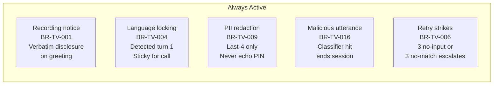
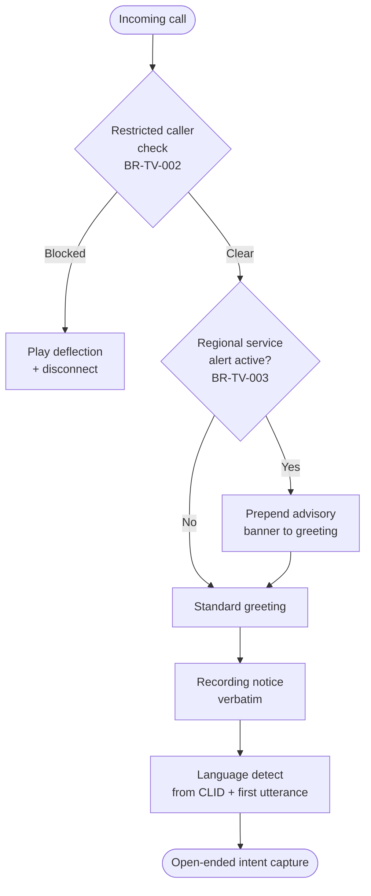
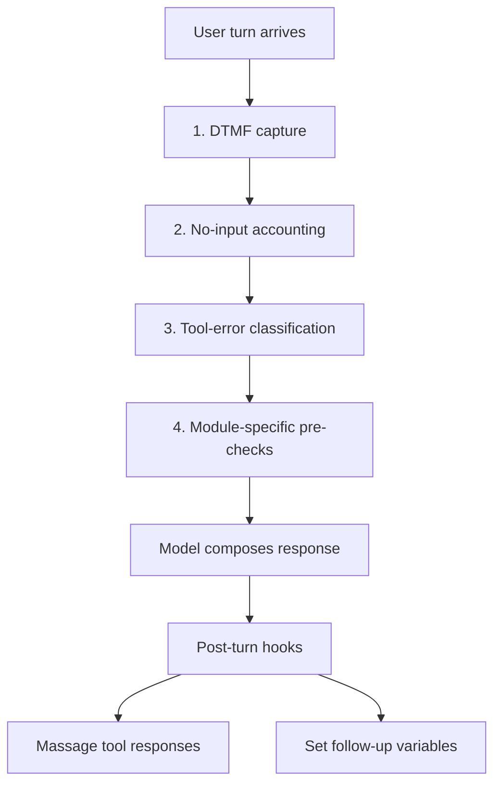
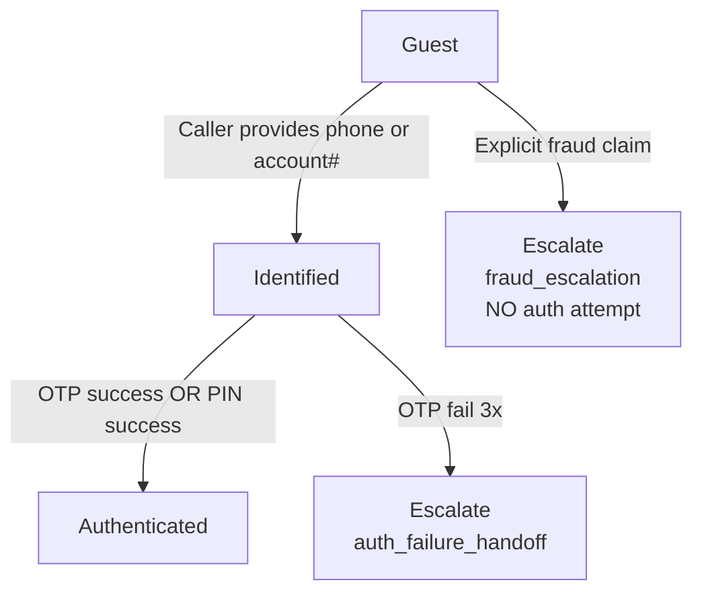
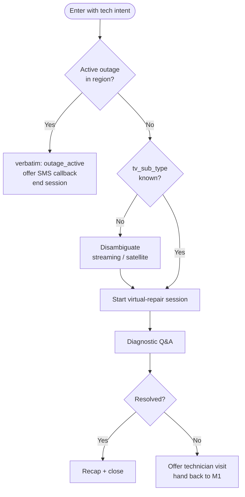
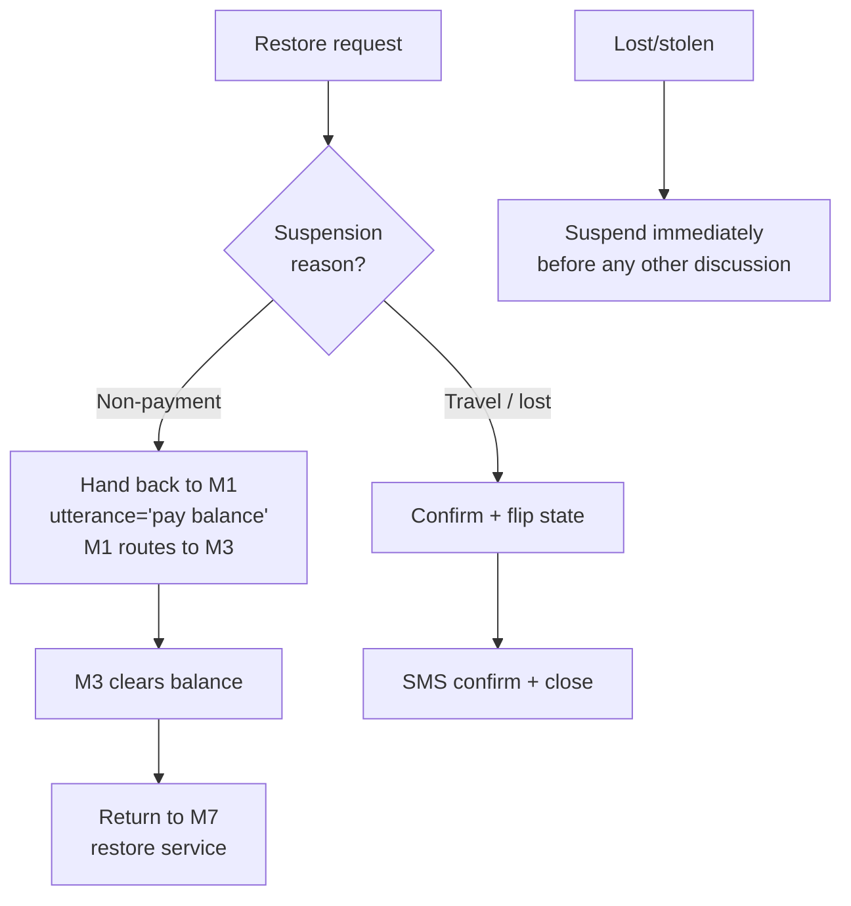

# Telco Voice Central — Agent Development Brief

**Functional spec and capability inventory for the engineers who will build the agent.**

Build a production voice agent that answers a consumer telco's main customer-service line and resolves the six most common contact reasons — **billing questions, technical support, sales & equipment, appointment management, account management, and service changes** — either self-contained or with a clean escalation to a live representative that carries full session context.

---

### How to read this document
This is a specification, not a walkthrough of an existing implementation. It describes the behaviors the agent must exhibit, the intents it must cover, the compliance rules it must respect, the data it must track, and the back-office tools that will be exposed to it. **You choose the architecture.** Whether you build one monolithic agent, several collaborating agents in a hub-and-spoke, a graph of specialists, or something else, is your call. Where sequencing genuinely matters (e.g., "authenticate before reading account data") it is called out as a requirement — everything else is left to the engineer.

### Terminology used here
- **"Module"** means a functional capability area (e.g., billing) — not a required agent, class, or process.
- **"Requirement" (`BR-TV-###`)** means a behavior the finished agent must exhibit and that the test suite will verify.
- **"Verbatim string"** means text that must be emitted exactly as written — the model must not paraphrase.

---

## Section 1 — Global Behavioral Requirements

These behaviors apply to every turn of every call regardless of which capability module is handling the caller.



- **Recording notice (`BR-TV-001`)**: The regional privacy disclosure is emitted verbatim on the initial greeting; if the caller asks whether they are being recorded, the disclosure is re-emitted verbatim.
- **Language locking (`BR-TV-004`)**: The caller's language is determined at the first turn from the area-code prefix plus first utterance and is locked for the remainder of the call. The lock is broken only by an explicit language-switch request from the caller ("primary language" / "secondary language" trigger words).
- **PII redaction (`BR-TV-009`)**: Account numbers, customer reference numbers, and card digits are read back only as the last 4 characters. PINs and OTP codes are never spoken back — the caller enters them; the system confirms success without echoing.
- **Malicious utterance handling (`BR-TV-016`)**: A per-turn classifier must run; on hit, the agent emits a polite closing line and ends the session with reason `malicious_input`.
- **Retry-strike escalation (`BR-TV-006`)**: Three consecutive no-input events or three unresolved no-match events on the same module trigger graceful escalation with reason `no_input_escalation` or `disambig_max_attempts`.
- **After-hours awareness (`BR-TV-014`)**: Live-agent queues are honored 24/7 for outage and fraud escalations. Sales, plan changes, and appointment booking route to next-business-day when the specialist queue is closed.

---

## Section 2 — Capability Modules Overview *(SPEC ONLY)*

The agent must cover the following eight functional capability areas. These are named "modules" for reference — the engineer chooses how to compose them into agents, sub-agents, tools, prompts, or any other structural element the chosen framework offers. What matters is that every capability listed is exercised correctly and that the behavioral requirements in this document are met end-to-end.

| ID | Module | Purpose | CUJs owned |
|---|---|---|---|
| **M1** | Session Lifecycle & Routing | Greet, capture identity, detect language, disambiguate intent, hand off to the right specialist capability, wrap and close. | Entry / exit for all CUJs |
| **M2** | Authentication & Identity | Verify caller via OTP or PIN; manage the auth ladder; escalate on failure. | Precondition for all authenticated CUJs |
| **M3** | Billing & Payment | Bill lookup, dispute cases, autopay, refunds, arrangements, deposits. | CUJ-2, part of CUJ-6 |
| **M4** | Technical Support & Virtual Repair | Outage lookup, sub-type disambiguation, virtual-repair session, SMS-delivered troubleshooting, ticket creation. | CUJ-3 (largest volume slice) |
| **M5** | Sales & Equipment | Plan catalog, service coverage, order placement, warranty claims, returns, SIM requests, number-transfer-in. | CUJ-5 |
| **M6** | Appointment & Ticket Management | Availability lookup, book / reschedule / cancel, technician-visit status. | CUJ-4 |
| **M7** | Account Management | Password reset, MFA management, fraud reporting, profile update, suspend / restore. | CUJ-1, part of CUJ-6 |
| **M8** | Secondary Language Fallback | Handle tech-support queries in the secondary language when the primary capability cannot cover them without language degradation. | CUJ-7 |

> **Modules ≠ agents.** You may implement two modules in the same agent, split one module across several agents, or wrap them as tools around a single model — whatever fits the target framework. The test suite (Section 21) validates behavior, not structure.

### Approximate call-volume distribution (drives where to invest tuning effort)
- **M4 Tech Support**: ~30%
- **M3 Billing**: ~25%
- **M5 Sales**: ~15%
- **M7 Account Management**: ~15%
- **M6 Appointments**: ~10%
- **Service Changes (M3 + M7)**: ~5%

---

## Section 3 — Call Lifecycle Requirements

The following sequence must execute before caller interaction begins. Implementation is unconstrained; the ordering is not.



- **Standard greeting (verbatim example)**:
  > "Welcome to Telco. I can help with billing, technical support, or managing your account. To get started, could you tell me the phone number or account number associated with your service?"
- **Do not skip the recording notice**: If the caller interrupts it, replay it in full on the next turn. This is audited quarterly against the recorded audio.

---

## Section 4 — Intent Coverage & Routing Table

The agent must correctly interpret and route the following intents. "Route to" names the capability module that should handle the request; the engineer decides how the routing decision is implemented (rule engine, model classification, prompt-based dispatch, framework transfer, etc.).

| Representative caller utterance | Route to | Auth required |
|---|---|---|
| "my bill is wrong" / "dispute a charge" | M3 | Yes |
| "I want to pay my bill" | M3 | Yes |
| "set up autopay" | M3 | Yes |
| "refund" / "credit back" | M3 | Yes |
| "internet is down" / "no service" | M4 | Yes |
| "TV says no signal" | M4 | Yes |
| "SIM not working" / "phone locked" | M4 | Yes |
| "I want to add TV" / "new plan" / "upgrade" | M5 | Recommended |
| "my phone is defective" / "warranty" | M5 | Yes |
| "transfer my number in" | M5 | Yes |
| "book a technician" / "reschedule my appointment" | M6 | Yes |
| "where is my technician" / "ticket status" | M6 | Yes |
| "forgot my password" / "reset login" | M7 | Identified only (see M2) |
| "disable two-factor" / "enable MFA" | M7 | Yes + step-up |
| "someone used my account" / "fraud" | M7 | Empathy → escalate (no auth attempt) |
| "restore my suspended service" | M7 (may bounce to M3 if balance owed) | Yes |
| "cancel my service" / "port out my number" | M7 | Yes + verbatim disclosure |
| Caller speaks in the secondary language, tech query out of primary coverage | M8 | Yes |
| "I want to talk to a person" | Escalate immediately, reason `user_requested_agent` | — |

### Disambiguation requirements
- Vague utterances must be clarified with a single targeted question, not a menu recital.
- At most 3 disambiguation attempts on the same turn before escalation.
- If the caller pivots mid-call (topic switch), the agent must re-classify — do not force the caller to complete the wrong flow. See `BR-TV-019`.

---

## Section 5 — Session Data Model

The agent must track approximately 60 session-scoped variables. The tables below are the canonical set; extend as needed for framework-specific bookkeeping, but do not rename the ones listed (they are referenced by name in test assertions and in the tool contracts). Fields tagged `PII` must be redacted to last-4 in any spoken output and in logs.

### Identity
| Variable | Source | Type | Notes |
|---|---|---|---|
| `clid` | session param | str | 10-digit caller ID from telephony. |
| `tfn` | session param | str | Toll-free number dialed. Drives per-brand routing. |
| `cirn` `[PII]` | captured | str | Customer reference number. Echoed last-4 only. |
| `billing_account` `[PII]` | captured | str | Billing account number. Echoed last-4 only. |
| `customer_type` | tool | `New` \| `Existing` | Drives sales paths. |
| `user_id` | tool | str | Internal CRM record id. |

### Auth state
| Variable | Source | Type | Notes |
|---|---|---|---|
| `auth_status` | tool (auth verify) | `Pass` \| `Fail` | NEVER mock or override in evals — short-circuits the auth flow. |
| `identification_status` | tool (profile lookup) | `Pass` \| `Fail` | NEVER mock or override in evals. |
| `business_flag` | tool | bool-str | Triggers business-account handoff. |

### Routing
| Variable | Source | Type | Notes |
|---|---|---|---|
| `route` | captured / classified | enum-str | Disambiguation output; drives which capability module handles the turn. |
| `lob` | captured | `mobility` \| `internet` \| `tv` \| `homephone` \| `smarthome` | Line of business. |
| `tv_sub_type` | captured | `streaming` \| `satellite` \| `streaming_only` \| `null` | TV sub-flow disambiguator. |
| `region` | tool | str | Region-A / Region-B / Region-C for coverage and outage lookups. |

### Conversation state
| Variable | Source | Type | Notes |
|---|---|---|---|
| `language` | channel / detected | `primary` \| `secondary` | Locked at turn 1. |
| `utterance` | captured | str | Latest caller intent text; consumed on cross-module topic switch. |
| `dtmf_digits` | per-turn preprocessing | str | DTMF captured during the current turn. |

### Counters & flags
| Variable | Source | Type | Notes |
|---|---|---|---|
| `local_noinput_counter` | per-turn preprocessing | int | Per-module no-input retry count; reset when the caller lands on a new module. |
| `global_err_count` | per-turn preprocessing | int | Cross-module error count; escalates at 3. |
| `no_match_confirmation_count` | per-turn preprocessing | int | No-match retry budget. |
| `misc_counter` | per-turn preprocessing | int | Generic per-flow counter. |
| `mock_mode` | eval harness only | str | Set in eval session parameters to make tools return synthetic success. Do NOT rely on in production sessions. |

### Payment / order
| Variable | Source | Type | Notes |
|---|---|---|---|
| `last_pmt_amt` | tool | float-str | Last payment amount. |
| `amount` | captured | float-str | Currently-discussed amount. |
| `ban_type` | tool | str | Billing account type. |
| `is_prepaid` | tool | bool-str | Drives prepaid-only paths. |
| `loyalty_limit` | tool | int | Loyalty-program adjustment ceiling. |

### Virtual-repair & ticketing
| Variable | Source | Type | Notes |
|---|---|---|---|
| `vr_task_count` | tool | int | Virtual-repair iteration counter. |
| `ticket_state` | tool | str | `open` / `in-progress` / `closed`. |
| `item_list` | captured | str | Captured equipment list. |
| `intent_type` | captured | str | Sub-intent classification (e.g., Physical Damage vs Defective). |
| `api_resp` | tool | str | Last API response payload (debug). |

### SMS & misc
| Variable | Source | Type | Notes |
|---|---|---|---|
| `sms_type` | captured | `Public` \| `Private` | Drives SMS payload format. |
| `sms_content` | captured | str | SMS body text. |
| `day_val`, `date_val`, `month_val`, `end_time`, `flag_val` | captured | str | Free-form per-flow temporaries. |

---

## Section 6 — Per-Turn Preprocessing Requirements

Every turn, before the model composes a response, the following behaviors must be observably true. Whether these are implemented as framework callbacks, middleware, prompt-level instructions, or hard-coded state machines is left to the engineer. The test suite verifies behavior, not implementation.



### Required preprocessing behaviors (in order)
1. **DTMF capture**: Any DTMF entered during the turn — whether delivered as a native DTMF part or as a text encoding like "user pressed 1234" — must be normalized and written to session variable `dtmf_digits` for the remainder of the turn.
2. **No-input accounting**: If the platform reports "no user activity" for the turn, increment `local_noinput_counter`. On the third consecutive miss on the same module, emit a polite handoff line and end the session with reason `no_input_escalation`. On misses 1–2, ask the caller to repeat.
3. **Tool-error classification**: Every tool response must be inspected. Classify errors as:
   - **System** (`SYSTEM_DOWN`, `INTERNAL_ERROR`, `AUTH_SERVICE_UNAVAILABLE`) → immediately end the session with reason `system_unavailable`. Do not retry, do not let the model attempt recovery.
   - **Business** (`INSUFFICIENT_FUNDS`, `NOT_ELIGIBLE`, `ALREADY_APPLIED`, …) → surface to the model; the model apologizes and offers an alternative.
   - **Validation** (`INVALID_INPUT`, `MALFORMED_REQUEST`) → ask the caller to repeat or clarify. Count toward `global_err_count`.
4. **Module-specific pre-checks**: Individual modules may need their own per-turn logic (e.g., checking whether an outage advisory should be prepended). Compose these however you like, but they must run before the model composes the response.

### Required post-turn behaviors
- Massage tool response payloads into the shape the next turn expects (extract nested fields into flat session variables where instructions read them).
- Any follow-up variable that a downstream turn depends on must be set on the turn where the value first becomes known.

> **Order matters:** DTMF first (so downstream logic sees the digits), no-input second (so retries fire before we touch tool errors), tool-error third, module pre-checks last. Reordering these has produced flaky evals in past implementations.

---

## Section 7 — Verbatim Copy Library

The following strings must be emitted verbatim when the corresponding condition occurs. The model must not paraphrase, contract, expand, or reorder them. Store them as constants (per language) and reference them by key from your instructions; the golden test suite asserts exact substring equality.

| Key | Primary language | Secondary language |
|---|---|---|
| `greeting_main` | "Welcome to Telco. I can help with billing, technical support, or managing your account. To get started, could you tell me the phone number or account number associated with your service?" | *(legal-approved translation required)* |
| `recording_notice` | "This call may be recorded for quality and training purposes." | *(legal-approved translation required)* |
| `id_verification_otp` | "For your security, I just sent a 6-digit code to that number — please read it back to me." | *(legal-approved translation required)* |
| `id_verification_pin` | "For your security, I'll need to verify your identity. Please enter the 4-digit PIN you set up." | *(legal-approved translation required)* |
| `live_agent_handoff` | "I'll connect you to a representative who can help. Please hold." | *(legal-approved translation required)* |
| `business_handoff` | "To get you the best support for your business account, I'll transfer you to an agent. You'll need to use your phone keypad instead of talking to the virtual assistant. Just a moment while I connect you." | *(legal-approved translation required)* |
| `payment_method_preamble` | *(PCI text — obtain from Legal / Compliance)* | *(legal-approved translation required)* |
| `contract_cancellation_fee_disclosure` | *(contract text — obtain from Legal)* | *(legal-approved translation required)* |
| `refund_confirmation_pattern` | "Your refund of ${amount} will appear on your next statement within {days} business days." | *(legal-approved translation required)* |
| `empathy_protocol` | "I'm very sorry to hear that you are facing challenges. I will ensure we handle your request with the utmost care." | *(legal-approved translation required)* |
| `outage_active` | "I see there's an active outage in your area. We're working on it. Would you like me to text you when it's restored?" | *(legal-approved translation required)* |
| `transfer_to_specialist` | "I'll connect you to a billing specialist now — they'll have everything we've already discussed." | *(legal-approved translation required)* |

> **Verbatim is enforced, not requested.** Instructions that ask the model to "say something like" for these strings will fail the compliance goldens. Reference the constant by key and instruct the model to emit its value exactly.

---

## Section 8 — Module M1: Session Lifecycle & Routing

The caller's entry point and exit point. Handles greeting, identity capture, disambiguation, hand-off to specialists, and closing.

### Functional responsibilities
- Emit the verbatim recording notice and the greeting (see Section 7).
- Detect and lock the caller's language.
- Capture the caller's open-ended intent utterance.
- Resolve caller identity (phone or account number) and trigger authentication (M2) when the target intent needs it.
- Classify the intent and hand off to the correct specialist module.
- Accept re-entries from specialists when the caller pivots to a new topic — re-classify and re-route rather than push the wrong flow forward.
- Handle explicit "talk to a person" requests → verbatim `live_agent_handoff` and end session with reason `user_requested_agent`.
- Emit the closing wrap on caller-confirmed completion.

### Backend tools consumed
- Caller profile lookup (see Tool Inventory, Section 16, Identity category)
- Routing classifier / rule evaluator (Routing category)
- Session-variable setters (State-mutation category)
- Malicious-utterance classifier (Safety category)
- Live-agent bridge / IVR handover (Handoff category)
- Session terminator (System / sentinel)

### Behavioral rules
- Never bypass authentication for account-mutation intents. Even if the caller has been "identified" via a profile lookup, mutation requires `auth_status == Pass`.
- Never invent account data if a lookup fails — end the session with `system_unavailable`.
- Never echo a PIN or OTP back to the caller under any circumstance.

---

## Section 9 — Module M2: Authentication & Identity

Three auth states: **Guest** (not yet identified), **Identified** (account resolved), **Authenticated** (identity verified via OTP or PIN). Sales and general questions may proceed at Identified; anything reading or mutating account data requires Authenticated.



### OTP flow — required behavior
1. Confirm the callback number back to the caller (last-4 only): *"I'll send a 6-digit code to +1-NXX-555-01xx. Ready?"*
2. Dispatch the OTP via the auth-send tool.
3. Emit the verbatim `id_verification_otp` string (see Section 7).
4. Accept the caller's response as either voice-spelled digits or DTMF; use whichever `dtmf_digits` contains if the caller keys it.
5. Verify via the auth-validate tool. On `Pass`, set `auth_status = Pass` and continue. On `Fail`, decrement attempts and reprompt.
6. On the third failure, escalate with reason `auth_failure_handoff`.

### PIN flow — required behavior (fallback when no reachable callback number)
1. Emit the verbatim `id_verification_pin` string.
2. Accept DTMF input only (voice-spelled PINs must be refused for security).
3. Verify via the PIN-validate tool.
4. Same 3-strike escalation as OTP.

### Behavioral rules
- Never echo the PIN or OTP back to the caller. The prompts explicitly instruct the caller to enter, not read.
- Never allow the model to fabricate an `auth_status = Pass`. Auth state must come from the verify tool's return value.
- Fraud claims skip auth entirely — see M7.

---

## Section 10 — Module M3: Billing & Payment

Owner of **CUJ-2** (bill dispute) and the balance-clearance path of **CUJ-6** (restore from non-payment).

### Functional responsibilities
- Look up recent bills.
- Identify a specific charge based on caller description (date, amount, or line item).
- Apply an auto-eligible adjustment or open a dispute case as appropriate.
- Configure autopay (with mandatory verbatim payment-method preamble).
- Issue refunds within policy threshold; escalate refunds above threshold.
- Offer payment arrangements.
- Answer deposit questions.

### Backend tools consumed
- Recent-bill lookup (Billing category)
- Dispute case creation (Billing category)
- Payment-processing wrapper (Billing category)
- Refund eligibility evaluator (Billing category)
- Autopay configuration (Billing category)
- Arrangement options lookup (Billing category)

### Behavioral rules
- Any step that reads a payment method must prepend the verbatim `payment_method_preamble`. Do not lead the caller to speak card numbers — capture via DTMF tokenized upstream.
- Refunds above policy threshold cannot be self-served → escalate with reason `refund_threshold_exceeded`.
- After a successful adjustment, the confirmation must include the amount and business-day window per `refund_confirmation_pattern`.

### Sample transcript (bill dispute, auto-eligible) — illustrative only
```text
Caller: There's a charge on my bill I don't recognize.
Agent:  I can help. Let me pull up your latest bill.
        I see a $12.50 charge dated last Tuesday from "AppleStreaming." Is that the one?
Caller: Yes.
Agent:  Because it's a small-dollar charge within our adjustment window,
        I can credit that back for you now.
        [verbatim: refund_confirmation_pattern] Your refund of $12.50 will appear
        on your next statement within 2 business days.
        Anything else I can help with?
```

---

## Section 11 — Module M4: Technical Support & Virtual Repair

Owner of **CUJ-3** (~30% of call volume — the largest single slice).

### Required diagnostic flow


### Functional responsibilities
- Check for regional outages before starting any diagnostic.
- Disambiguate service sub-type (streaming / satellite / streaming-only) before any TV-specific diagnostic — never assume.
- Open a virtual-repair session; record customer answers to diagnostic questions.
- Deliver step-by-step troubleshooting via SMS for anything longer than 2 sequential steps; otherwise walk verbally in short steps.
- On unresolved: offer a technician visit (hand back to M1 for cross-module routing to M6) or open a ticket.

### Backend tools consumed
- Regional outage status (Tech Support category)
- Virtual-repair session lifecycle (Tech Support category)
- Diagnostic answer capture (Tech Support category)
- Ticket lookup (Tech Support category)
- SMS payload prep + dispatch (SMS category)

> **Prefer SMS for long instruction chains.** Verbal instruction lists longer than 2 steps blow past caller attention. Offer the SMS variant first, fall back to speech only if the caller declines.

---

## Section 12 — Module M5: Sales & Equipment

Owner of **CUJ-5**.

### Functional responsibilities
- Check service coverage at the caller's address.
- Present 2–3 comparable plan options (never the full catalog — pick a curated shortlist).
- Place an order once the caller selects; return order number and delivery ETA.
- Send an SMS receipt on order confirmation.
- Handle warranty claims (in-warranty and out-of-warranty separately).
- Handle number-transfer-in requests.

### Backend tools consumed
- Coverage check (Sales category)
- Plan catalog (Sales category)
- Order placement (Sales category)
- Warranty claim (Sales category)
- Number-transfer initiation (Sales category)

### Behavioral rules
- Business callers (`business_flag == true`) never proceed through this module. Emit the verbatim `business_handoff` line and end the session with reason `business_handoff`. No self-serve attempt.
- Do not present more than 3 plan options — analysis paralysis defeats the sale.

---

## Section 13 — Module M6: Appointment & Ticket Management

Owner of **CUJ-4**.

### Functional responsibilities
- Look up active appointments for the caller's account.
- Offer 2–3 availability slots when booking or rescheduling.
- Commit reschedule / cancel; confirm back to caller; send SMS confirmation.
- Return technician-visit status on request.
- Look up existing tickets.

### Backend tools consumed
- Active-appointment lookup (Appointments category)
- Availability window (Appointments category)
- Reschedule / cancel commit (Appointments category)
- Ticket lookup (shared with M4)

### Behavioral rules
| Situation | Required behavior |
|---|---|
| Single active appointment | Confirm details back; proceed. |
| Multiple active appointments | Disambiguate by service type or address. |
| Same-day cancellation | Confirm twice. Once the technician is dispatched, no take-backs. |
| Technician en-route | Cannot cancel; explain politely, offer to leave a note. |
| No availability in requested window | Offer SMS callback when a slot opens. |

---

## Section 14 — Module M7: Account Management

Owner of **CUJ-1** and the non-balance path of **CUJ-6**.

### Functional responsibilities
- Dispatch a password-reset SMS link (30-minute validity).
- Enable / disable MFA (requires step-up authentication).
- Handle fraud reports — empathy line + immediate escalation, no self-serve.
- Update profile fields.
- Send self-serve registration SMS.
- Suspend or restore service.

### Backend tools consumed
- Password-reset SMS dispatch (Account category)
- MFA enable / disable (Account category)
- Fraud report (Account category)
- Profile update (Account category)
- Suspend / restore executor (Account category)

### Suspend / restore flow — required behavior


### Behavioral rules
- **Fraud reports**: emit verbatim `empathy_protocol`, then escalate with reason `fraud_escalation`. No auth attempt, no self-serve.
- **Cross-module dependency (restore-from-non-payment)**: must hand back through M1 rather than call M3 directly. Never bypass the routing layer.
- **Lost / stolen**: suspend the service before engaging in any other conversation.

---

## Section 15 — Module M8: Secondary Language Fallback

Owner of **CUJ-7**. Handles tech-support queries in the secondary language when the primary M4 implementation cannot serve them without language degradation.

### When to route here vs. keep in the primary module
- Route here when `language == secondary` AND `route == tech` AND M4's primary-language content lacks coverage for the specific symptom.
- All other secondary-language calls (billing, sales, appointments, account management) stay in their normal module — tools already return localized data and the model emits in the locked language.

### Terminal fallback behavior
If the caller's issue is outside M8's supported set, emit the verbatim `live_agent_handoff` (in the secondary language) and end the session with reason `secondary_language_live_agent`.

> **Language must never degrade mid-call.** A call that starts in the secondary language must end in the secondary language — either fully self-served or transferred to a secondary-language human. A half-primary / half-secondary transcript is a P0 defect.

---

## Section 16 — Error Recovery & Retry Requirements

Three independent counters drive graceful degradation. The agent must maintain them and act on their thresholds regardless of which module owns the current turn.

| Counter | Threshold | Action on breach | Reason code |
|---|---|---|---|
| `local_noinput_counter` | 3 | Escalate to live agent with polite handoff. | `no_input_escalation` |
| `no_match_confirmation_count` | 3 | Escalate with disambiguation-failure handoff. | `disambig_max_attempts` |
| `global_err_count` | 3 | End session; too many hard errors accumulated. | `too_many_errors` |

> **Never fabricate data.** If a tool fails and the agent invents a bill amount or a plan detail to keep the conversation flowing, that is a P0 safety defect. Every generation path that reads account data must be conditioned on a successful tool response.

---

## Section 17 — Available Backend Tool Inventory

The following back-office capabilities are (or will be) exposed as callable tools to the agent. The engineer wires them into whichever framework the agent runs in. Every tool exposes both a real backend call and a `mock_mode` branch that returns synthetic success without touching the backend — this is what makes offline evals deterministic.

### Representative tool contracts
| Tool | Input | Output | Category |
|---|---|---|---|
| `fetch_customer_profile` | `{ clid: string }` | `{ identification_status, customer_type, business_flag, is_prepaid, ... }` | Identity |
| `send_authentication_otp` | `{ clid: string }` | `{ sent: bool, expires_in_sec: int }` | Auth |
| `validate_authentication_otp` | `{ code: string }` | `{ auth_status: "Pass" \| "Fail", attempts_remaining: int }` | Auth |
| `validate_authentication_pin` | `{ pin: string }` | `{ auth_status: "Pass" \| "Fail", attempts_remaining: int }` | Auth |
| `evaluate_routing_rules` | `{ utterance: string, entities: object }` | `{ route: string, confidence: float, requires_auth: bool }` | Routing |
| `fetch_recent_bills` | `{ billing_account: string }` | `{ bills: [{ id, date, amount, line_items }] }` | Billing |
| `create_dispute_ticket` | `{ charge_id, reason, notes }` | `{ ticket_id: string, eta_business_days: int }` | Billing |
| `check_regional_outage` | `{ region: string, lob: string }` | `{ active: bool, restoration_eta_iso: string \| null }` | Tech Support |
| `start_virtual_repair` | `{ cirn, lob, symptom }` | `{ session_id, first_diagnostic_question }` | Tech Support |
| `fetch_availability_slots` | `{ zip, service_type }` | `{ slots: [{ date, window, technician_id }] }` | Appointments |
| `commit_appointment_reschedule` | `{ appt_id, new_slot }` | `{ confirmed: bool, new_date: string }` | Appointments |
| `fetch_plan_catalog` | `{ lob, customer_type }` | `{ plans: [{ id, name, price, key_features }] }` | Sales |
| `send_password_reset_sms` | `{ cirn }` | `{ sent: bool, valid_minutes: int }` | Account |
| `execute_suspend_restore` | `{ cirn, action: "suspend" \| "restore", reason }` | `{ new_state: string, effective_iso: string }` | Account |
| `execute_live_agent_handover` | `{ reason: string, session_context: object }` | `{ handover_id: string, queue: string }` | Handoff |

### Approximate inventory by category
| Category | Approx. count | Naming conventions used |
|---|---|---|
| Identity & profile | ~20 | `fetch_*`, `lookup_*`, `load_*_configs` |
| Auth (OTP / PIN) | ~10 | `send_authentication_*`, `validate_authentication_*` |
| Routing & disambiguation | ~12 | `evaluate_routing_*`, `update_routing_state` |
| Billing & payments | ~80 | `fetch_recent_bills_*`, `process_payment_*`, `create_dispute_*` |
| Tech support & virtual repair | ~35 | `check_*_outage`, `start_virtual_repair`, `lookup_*_ticket` |
| Sales & equipment | ~18 | `fetch_plan_catalog`, `place_new_order`, `process_warranty_claim` |
| Appointments | ~30 | `fetch_availability_*`, `commit_appointment_*` |
| SMS / messaging | ~8 | `prepare_sms_payload`, `send_sms` |
| Handoff & escalation | ~6 | `execute_live_agent_handover`, `execute_business_handover` |
| State mutation helpers | ~25 | Session-variable setters, context updaters |
| Content / RAG datastores | ~6 | Language-tagged content stacks for grounded answers |

### Requirements every tool must satisfy
- **Mock-mode branch**: When session variable `mock_mode == "True"`, the tool returns a canned success payload without touching the backend. Non-optional — evals depend on it.
- **Error envelope**: Errors are returned as `{ "error": "<CODE>", "message": "<human>" }`, where `<CODE>` is one of the System / Business / Validation codes documented in Section 6.
- **Idempotency**: Any mutating tool (order placement, appointment commit, payment) must be safe to retry with the same input.
- **PII handling**: Tool responses that include full PII must be marked so upstream logging can redact.

---

## Section 18 — Requirements Register (BR-TV-001 … BR-TV-020)

| # | ID | Name | Description |
|---|---|---|---|
| 1 | `BR-TV-001` | Recording notice | Every call opens with the verbatim recording-notice line in the locked language. |
| 2 | `BR-TV-002` | Restricted caller check | Incoming caller ID is checked against a blocklist before greeting; blocked calls hear a deflection line and disconnect. |
| 3 | `BR-TV-003` | Regional service alert | Active regional service alerts prepend an advisory banner to the greeting. |
| 4 | `BR-TV-004` | Language locking | Language is detected at turn 1 and locked for the rest of the call unless the caller explicitly switches. |
| 5 | `BR-TV-005` | Module coverage | Every intent listed in Section 4 must reach the correct capability module. |
| 6 | `BR-TV-006` | Retry strikes | 3 no-input or 3 no-match on the same module triggers graceful escalation. |
| 7 | `BR-TV-007` | DTMF capture | DTMF entries are normalized and made available as `dtmf_digits` on the turn they arrive. |
| 8 | `BR-TV-008` | Auth ladder | Guest → Identified → Authenticated. Anything reading or mutating account data requires Authenticated. |
| 9 | `BR-TV-009` | PII redaction | Account #, customer reference #, card # echoed last-4 only. PIN and OTP never echoed. |
| 10 | `BR-TV-010` | Tool-error tri-state | System errors escalate immediately; business errors surface to the model; validation errors trigger retry. |
| 11 | `BR-TV-011` | Verbatim compliance | Every compliance string in Section 7 emitted verbatim; enforced by golden assertions. |
| 12 | `BR-TV-012` | Business handoff | Business-flagged accounts receive the verbatim business-handoff line and escalate; no self-serve attempt. |
| 13 | `BR-TV-013` | Fraud escalation | Fraud claims trigger the empathy line and immediate escalation; no auth or self-serve attempt. |
| 14 | `BR-TV-014` | After-hours awareness | Live-agent queues honored 24/7 for outage & fraud. Sales, plan changes, appointments route to next-business-day when closed. |
| 15 | `BR-TV-015` | Session-context handoff | Every escalation carries the session variables to the live agent. |
| 16 | `BR-TV-016` | Malicious utterance | Classifier hits end the session with reason `malicious_input`. |
| 17 | `BR-TV-017` | No invented data | If a tool fails, the agent must not invent account data. Every account-read generation path is conditioned on a successful tool response. |
| 18 | `BR-TV-018` | Audio recording | Every call produces a .wav in the session-audio bucket; verified by audit. |
| 19 | `BR-TV-019` | Topic switch mid-call | The agent must re-classify and re-route when the caller pivots mid-call; do not force the wrong flow. |
| 20 | `BR-TV-020` | Language non-degradation | A call that starts in one language ends in the same language (self-served or transferred to a human speaking it). |

---

## Section 19 — Example User Journeys (Test Scenarios)

Each of the seven CUJs is captured below as a runnable simulation scenario. Use these as inputs to the sim-eval framework; agents that satisfy the expectations in each scenario are considered to meet the functional requirement for that CUJ.

```yaml
- name: cuj_1_account_password_reset
  primary_module: M7
  volume_share: 15%
  steps:
    - goal: "Reset self-serve portal password via SMS link"
      success_criteria: "Agent identifies caller, dispatches SMS reset link, states 30-min validity"
      response_guide: "Say 'I forgot my password.' Provide phone number when asked. Accept SMS link."
      max_turns: 8
      expectations:
        - "Agent must authenticate before dispatching the link"
        - "Agent must NOT attempt to reset the password itself (self-serve link only)"
        - "Agent must state the 30-minute validity window"
        - "Agent must NOT echo the reset link value in the transcript"

- name: cuj_2_billing_dispute_auto_eligible
  primary_module: M3
  volume_share: 25%
  steps:
    - goal: "Dispute a small-dollar charge that is auto-adjustment eligible"
      success_criteria: "Agent looks up bill, identifies the charge, applies adjustment, states refund"
      response_guide: "Say 'There is a $12 charge on my bill I do not recognize.' Confirm when identified."
      max_turns: 10
      expectations:
        - "Agent must call the recent-bills lookup before referencing any specific charge"
        - "Agent must state refund amount and business-day window per refund_confirmation_pattern"
        - "Agent must NOT open a dispute case (this charge is auto-eligible)"

- name: cuj_3_tech_support_tv_signal
  primary_module: M4
  volume_share: 30%
  steps:
    - goal: "Resolve a 'no signal' TV issue with no active outage"
      success_criteria: "Agent checks outage, disambiguates tv_sub_type, starts VR session, offers steps"
      response_guide: "Say 'My TV says no signal.' Answer diagnostic questions concisely. Accept solution."
      max_turns: 12
      expectations:
        - "Agent must check regional outage first"
        - "Agent must disambiguate tv_sub_type before starting VR"
        - "Agent must offer SMS steps when there are more than 2 sequential troubleshooting steps"

- name: cuj_4_appointment_reschedule
  primary_module: M6
  volume_share: 10%
  steps:
    - goal: "Reschedule an existing technician appointment"
      success_criteria: "Agent finds the appointment, offers 2-3 available slots, commits the change"
      response_guide: "Say 'I need to move my technician appointment.' Pick the first offered slot."
      max_turns: 8
      expectations:
        - "Agent must look up active appointments before offering slots"
        - "Agent must state the new date/time back to the caller for confirmation"
        - "Agent must send SMS confirmation after commit"

- name: cuj_5_sales_add_tv_existing
  primary_module: M5
  volume_share: 15%
  steps:
    - goal: "Add TV service to an existing authenticated account"
      success_criteria: "Agent checks coverage, presents 2 plans, places order, states order number"
      response_guide: "Say 'I would like to add TV service.' Pick the cheaper of the two offered plans."
      max_turns: 10
      expectations:
        - "Agent must check service coverage before presenting plans"
        - "Agent must present exactly 2-3 comparable plan options (not the full catalog)"
        - "Agent must state the order number after the order tool returns"

- name: cuj_6_restore_service_from_non_payment
  primary_module: M7 (with cross-module dependency on M3)
  volume_share: 5%
  steps:
    - goal: "Restore a service that was suspended for non-payment"
      success_criteria: "Agent detects non-payment reason, routes back through M1 to M3 to clear, returns to M7"
      response_guide: "Say 'My service is suspended and I want it back on.' Agree to pay the balance."
      max_turns: 14
      expectations:
        - "Agent must NOT attempt restore before the balance is cleared"
        - "Cross-module routing must go through M1 (no direct M7 → M3 transfer)"
        - "Final restore step must send SMS confirmation"

- name: cuj_7_secondary_language_tech_fallback
  primary_module: M8
  volume_share: "subset of CUJ-3"
  steps:
    - goal: "Handle a secondary-language tech query that M4 cannot cover"
      success_criteria: "M1 routes to M8; the agent stays fully in the secondary language; either solves or escalates"
      response_guide: "Speak entirely in the secondary language. Describe a tech symptom."
      max_turns: 10
      expectations:
        - "The transcript must never contain a primary-language response"
        - "If unresolved, escalate with reason 'secondary_language_live_agent'"
```

---

## Section 20 — Priority Hierarchy

When two behaviors could fire on the same turn, resolve in this order (highest first). Every module's instruction must respect this list.

1. **Safety signals** — self-harm, threat, malicious input → empathy line + immediate escalation or session end. Overrides everything else.
2. **Fraud claim** — reason `fraud_escalation`. No auth attempt, no self-serve.
3. **System-error escalation** — hard tool errors (`SYSTEM_DOWN`, etc.) → immediate handoff.
4. **Explicit "talk to a person"** — verbatim `live_agent_handoff`, reason `user_requested_agent`.
5. **Business-account handoff** — `business_flag == true` → verbatim `business_handoff`.
6. **Retry-strike escalation** — 3× no-input or 3× no-match on the same module.
7. **Compliance-locked verbatim turns** — recording notice, PCI preamble, cancellation-fee disclosure, refund confirmation. Never paraphrased.
8. **Authenticated account actions** — the actual customer task.
9. **Disambiguation** — one clarifying question, max 3 attempts.
10. **Small talk / recap / closing** — lowest priority; only fires when nothing above applies.

---

## Section 21 — Testing & Evaluation Requirements

The agent must pass the following test surface before promotion to production. Test authoring is the engineer's responsibility; test coverage targets are non-negotiable.

| Test kind | Purpose | Coverage target |
|---|---|---|
| **Tool-contract tests** | Verify each tool exposes both a real branch and a working `mock_mode` branch; error envelope is well-formed. | 100% of tools |
| **Per-turn preprocessing tests** | Verify DTMF capture, no-input counting, tool-error classification, malicious-utterance classifier behave per Section 6. | All 4 behaviors, both happy path & boundary |
| **Deterministic goldens** | Assert verbatim compliance strings, PII redaction, session-variable handoff on escalation, reason codes. | Every string in Section 7; every reason code referenced in Sections 8–15 |
| **Sim scenarios** | End-to-end multi-turn evaluation of each CUJ (Section 19), plus cross-CUJ topic switches. | All 7 CUJs; ≥ 60% pass rate baseline; ≥ 90% before production |
| **Audio-mode audit** | Run top sims through the real audio stack; verify TTS pronunciation, DTMF capture end-to-end, no compliance drift. | All P0 scenarios per release candidate |
| **Telephony-loop test** | Real dial-in through the phone number to verify barge-in and DTMF at the wire. | Once per release |
| **Compliance audit** | Manual review of 50 calls per language for verbatim compliance and zero PII disclosure. | Quarterly + on any change to a verbatim string |

---

### Definition of Done

> A production-ready Telco Voice Central hits: **≥ 60% in-agent resolution, ≤ 4 min average handle time, 100% verbatim compliance on the audited strings, zero PII disclosures across the audit set, 100% audio-recording coverage, and no regressions on the P0 golden set for two consecutive deploys.**

---
*Telco Voice Central · Agent Development Brief · Anonymized reference for workshop use · go/telco-voice*
