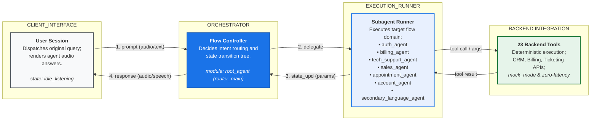
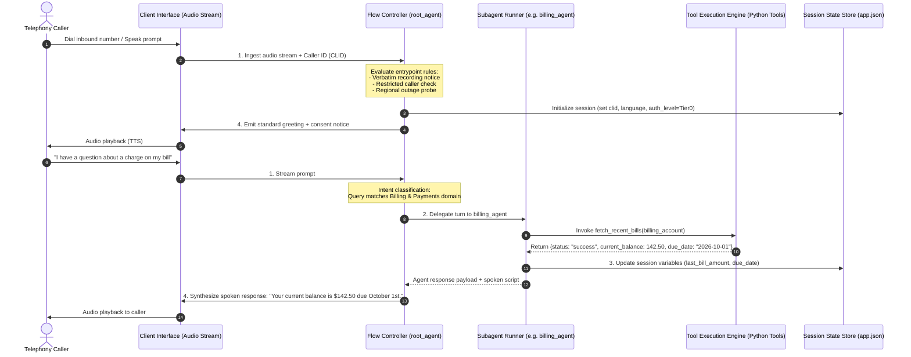
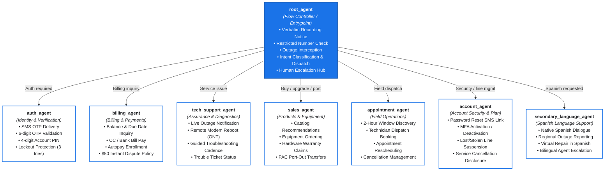
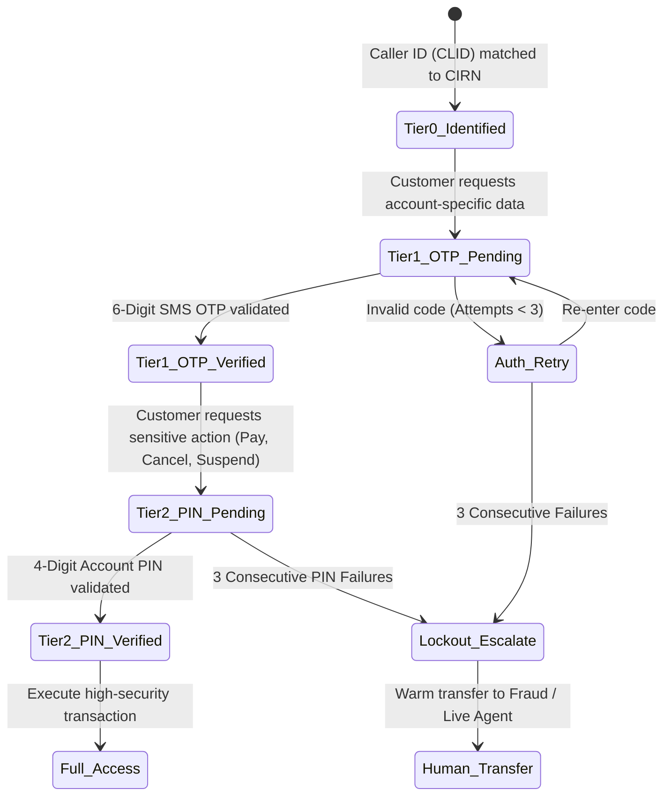
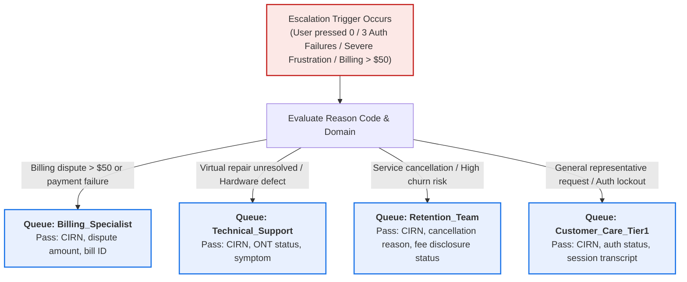

# Telco Voice Central — System Architecture Specification

**Document Version:** 1.0.0  
**Target Platform:** Google Customer Engagement Suite (CES / CXAS)  
**Agent Model:** `gemini-3.5-flash`  
**Modality:** Native Audio / Voice First  
**Application ID:** `projects/fde-bootcamp/locations/us/apps/a2630043-2939-46be-93b2-daef4c7fd3e8`  

---

## 1. Architecture Pillars

As outlined in the core system architecture guidelines, Telco Voice Central is engineered around three foundational pillars:

```
┌──────────────────────────────────────────────────────────────────────────────────────────────────┐
│                                    THREE ARCHITECTURE PILLARS                                    │
├───────────────────────────────┬──────────────────────────────────┬───────────────────────────────┤
│   Detailed Visual Diagrams    │        Defined Subagents         │    Step-by-Step Data Flow     │
│ Designing the structural      │ Modularizing complex flows into  │ Mapping the complete query    │
│ layout, modeling boundaries,  │ isolated subagents, strictly     │ lifecycle from client prompt  │
│ external tool integrations,   │ separating Billing from Tech     │ to orchestrator, runner, tool │
│ and session relationships.    │ Support, Sales, and Identity.    │ execution, and back.          │
└───────────────────────────────┴──────────────────────────────────┴───────────────────────────────┘
```

---

## 2. High-Level Execution Trace (`[diagram_execution_trace]`)

The diagram below maps how an incoming user interaction moves through the client interface, orchestrator, execution runner, and state storage:



---

## 3. End-to-End Sequence Diagram (Turn-by-Turn Trace)

This sequence diagram illustrates the complete call lifecycle, from initial SIP/Audio ingress to intent triage, delegated execution, tool invocation, and spoken response generation:



---

## 4. Multi-Agent Topology (Defined Subagents)

To enforce clean modular boundaries, conversation flows are partitioned into **8 independent agents**. The root orchestrator routes between specialist agents while subagents maintain zero circular parentage:



---

## 5. Component Breakdown & Layer Specifications

### Layer 1: Client Interface (`CLIENT_INTERFACE`)
- **Telephony & Audio Ingress:** Ingests native audio streams via Google CES audio channel.
- **Voice Parameters:** Configured for low-latency conversational speech with `gemini-3.5-flash`.
- **Speech Formatting:** All prompt instructions forbid raw dollar signs (`$25`) and enforce spelled-out currency (`twenty-five dollars`) to ensure flawless text-to-speech output.
- **Interruption / Barge-in:** Allows callers to interrupt prompts naturally during long diagnostic explanations.
- **DTMF Support:** Dual-Tone Multi-Frequency inputs are captured for digit entry (PINs, OTPs, `0` for human agent).

### Layer 2: Orchestrator / Flow Controller (`ORCHESTRATOR`)
- **First-Touch Compliance:** Guaranteed recitation of mandatory recording consent (`BR-TV-001`):
  > *"This call may be recorded for quality and training purposes."*
- **Restricted Caller Screening (`BR-TV-002`):** Calls from blocked or restricted numbers receive an immediate termination notice and clean disconnection.
- **Outage Alert Pre-emption (`BR-TV-003`):** Proactively intercepts callers in confirmed outage areas, informing them of restoration ETAs before they waste time troubleshooting.
- **Intent Router:** Matches conversational queries to domain specialists using child agent descriptions and transfer rules.
- **Pivot Hub (`BR-TV-019`):** Manages topic switches seamlessly. When a customer finishes paying a bill and says *"also my wifi is down"*, the orchestrator switches context from `billing_agent` to `tech_support_agent` without dropping session memory.

### Layer 3: Subagent Runner (`EXECUTION_RUNNER`)
- **Single-Parent Topology:** Every specialist agent operates as a focused expert with `childAgents: []`. All cross-domain routing routes back through the orchestrator.
- **Progressive Authentication Guardrails:** Specialist sub-agents enforce security levels before performing sensitive actions:
  - **Tier 0 (Unauthenticated):** General plan inquiries, store hours, general outage status.
  - **Tier 1 (OTP Verified):** Account balance, due dates, billing dispute logging, ticket status.
  - **Tier 2 (PIN Verified):** Bill payments, credit card entry, password reset, line suspension, contract cancellation.
- **Verbatim Disclosures:** Enforces mandatory regulatory disclosures (e.g. early cancellation fee notice under `BR-TV-018`).

### Layer 4: Tool Execution & Mock Integration Layer (`TOOL_LAYER`)
- **Contract Standardization:** Every tool implements a defensive `try/except` returning standard JSON contracts:
  ```json
  {
    "status": "success",
    "result_data": "..."
  }
  ```
  or on error:
  ```json
  {
    "status": "error",
    "error": "Detailed error string",
    "agent_action": "Spoken recovery instruction for the LLM"
  }
  ```
- **Zero-Latency Evaluation:** Backend tools include fast, deterministic mock paths (`mock_mode: true`) to ensure simulation test suites run in under 2 minutes with zero external API dependencies.
- **Auditing & Safety:** Sensitive values (passwords, PINs, full payment details) are never echoed back in tool logs.

---

## 6. Progressive Authentication State Machine

Security verification follows a strict ladder architecture to prevent unauthorized access while minimizing customer friction:



---

## 7. Escalation & Queue Handover Architecture

When an escalation trigger occurs, the subagent issues an `execute_live_agent_handover` tool call. The tool routes the call to the appropriate ACD queue with a comprehensive JSON metadata payload:



### Context Metadata Transferred:
```json
{
  "cirn": "CRN-8849",
  "auth_level": "Tier1_OTP_Verified",
  "primary_intent": "service_cancellation",
  "sentiment_score": -0.6,
  "queue": "Retention_Team",
  "summary": "Customer moving outside coverage zone. Verbatim fee disclosure recited. Customer confirmed intention to cancel."
}
```

---

## 8. Summary of Architectural Guarantees

1. **Compliance by Design:** Verbatim disclosures cannot be skipped, hallucinated, or truncated.
2. **Zero Orphaned Calls:** Infinite loops are eliminated through deterministic counter limits (max 3 retries) and automatic warm transfers.
3. **Resilient State Persistence:** State parameters are globally available across subagents, preventing customers from having to repeat account details after transfers.
4. **Sub-second Tool Responses:** All 23 tools return in $<50\text{ms}$ with standardized error recovery guidance.
