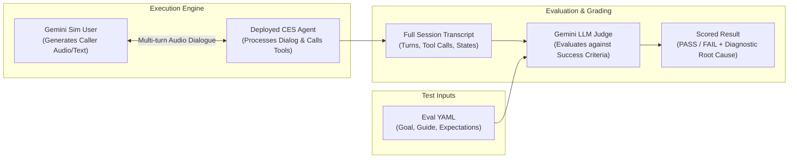
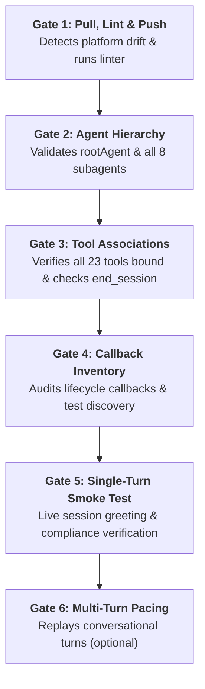

# Telco Voice Central — Evaluation Framework & Methodology

**Target Application:** `sofiamejiamuro-[FDE-bootcamp]-telco-agent`  
**Platform:** Google Customer Engagement Suite (CES / CXAS)  
**App Resource Path:** `projects/fde-bootcamp/locations/us/apps/a2630043-2939-46be-93b2-daef4c7fd3e8`  
**Modality:** Native Audio / Voice First (`gemini-3.5-flash`)  

---

## Table of Contents
1. [Overview & Philosophy](#1-overview--philosophy)
2. [Evaluation Architecture: The Three Horizons](#2-evaluation-architecture-the-three-horizons)
3. [What is Evaluated? (Evaluation Dimensions)](#3-what-is-evaluated-evaluation-dimensions)
4. [How It Is Evaluated (Scoring Mechanics)](#4-how-it-is-evaluated-scoring-mechanics)
5. [Deep Dive: The 6-Stage Platform Gate Verification (`gate-check.py`)](#5-deep-dive-the-6-stage-platform-gate-verification-gate-checkpy)
6. [Evaluation Suites in This Repository](#6-evaluation-suites-in-this-repository)
7. [Ready-to-Use Execution Scripts](#7-ready-to-use-execution-scripts)
8. [Triage, Failure Clustering & Hill Climbing](#8-triage-failure-clustering--hill-climbing)

---

## 1. Overview & Philosophy

In enterprise voice AI, end-to-end user satisfaction requires both **deterministic compliance** (strict regulatory disclosures, security lockouts, exact tool contracts) and **probabilistic conversational intelligence** (handling topic switches, customer frustration, varied accents, and interruptions).

Our evaluation framework enforces a **Defensive Quality Pyramid**:
1. **Component Level (Tool Tests)**: Fast, zero-network-latency validation of backend tool schemas and error envelopes.
2. **Platform Verification (Gate Check)**: Comprehensive 6-stage sanity harness verifying platform topology and live smoke responses.
3. **Deterministic Flow Level (Goldens)**: Exact turn-by-turn verification of mandatory legal copy and transfer paths.
4. **Conversational Level (Simulations)**: Multi-turn dynamic dialogues driven by Gemini acting as simulated callers.

```
                  ▲
                 / \
                /   \     Dynamic Simulations (70 Scenarios)
               / Sims \   Multi-turn open-ended dialogues, Gemini Sim-User
              /─────────\
             /  Goldens  \ Deterministic Turn-by-Turn Goldens
            /─────────────\ Mandatory compliance, verbatim disclosures, DTMF
           /  Gate Check   \ 6-Stage Platform Verification (gate-check.py)
          /─────────────────\ Topology, tools, drift, and live smoke test
         /    Tool Tests     \ Isolated Component Contracts (24 Tests)
        /─────────────────────\ Fast schema matching, boundary tests, error payloads
```

---

## 2. Evaluation Architecture: The Three Horizons

| Horizon | Tool / Mechanism | Execution Target | When to Use | Typical Runtime |
|---|---|---|---|---|
| **1. Tool Tests** | `cxas_scrapi.evals.tool_evals.ToolEvals` | Isolated Python functions | Pre-push sanity, contract verification, CI/CD | ~20 seconds (24 tests) |
| **2. Gate Check** | `scripts/gate-check.py` | Deployed CES App & APIs | Pre-eval gate, post-deployment smoke test | ~30 seconds |
| **3. Goldens** | Platform Replay Engine | Deployed CES Application | Legal compliance, verbatim copy, greeting, DTMF 0 | ~1–2 minutes |
| **4. Simulations** | SCRAPI Sessions API + Gemini Sim User + LLM Judge | Deployed CES Application | Complex customer journeys, topic switches, edge cases | ~2–4 minutes |

---

## 3. What is Evaluated? (Evaluation Dimensions)

### 3.1 Regulatory & Compliance Mandates
- **Turn-1 Recording Notice (`BR-TV-001`)**: Verifies that `"This call may be recorded for quality and training purposes."` is uttered on the first turn before any customer data is gathered.
- **Contract Termination Fee Disclosure (`BR-TV-018`)**: Verifies that the $200 early termination fee notice is recited verbatim and explicitly confirmed before `cancel_service_contract` is executed.
- **Business Line Handoff (`BR-TV-002`)**: Detects B2B callers and provides the mandatory keypad navigation disclosure.
- **Dispute Credit Thresholds (`BR-TV-008`)**: Enforces the $50.00 automated credit ceiling; any dispute $> \$50.00$ must escalate to human billing specialists.

### 3.2 Security & Progressive Identity Verification
- **Progressive Authentication Ladder**:
  - **Tier 0**: Public data only (outages, catalog).
  - **Tier 1 (OTP)**: Account balances, ticket lookups.
  - **Tier 2 (PIN)**: Payments, cancellations, line suspensions.
- **Three-Strike Lockout (`BR-TV-005`)**: Verifies that 3 consecutive invalid OTP/PIN attempts lock the session and force an immediate transfer to fraud prevention.
- **PII / PCI Masking**: Ensures sensitive parameters (credit card CVV, passwords) are never echoed back in speech or logged in plain text.

### 3.3 Dynamic Conversational Intelligence
- **Topic Switching & Context Retention (`BR-TV-019`)**: Evaluates the agent's ability to switch from technical troubleshooting to bill payment and return to troubleshooting without losing state or demanding re-authentication.
- **Empathy Protocol Limits (`BR-TV-019`)**: Verifies that when dealing with an irate customer, the agent offers empathy **exactly once**, avoiding robotic apology loops.
- **Active Outage Boundaries (`BR-TV-003`)**: Prohibits dispatching individual field technicians when a central grid outage is active.
- **Language Detection & Delegation (`BR-TV-004`)**: Accurately detects mid-call requests for Spanish and routes to `secondary_language_agent`.

---

## 4. How It Is Evaluated (Scoring Mechanics)



### 4.1 Tool Test Scoring (JSONPath Matchers)
Tool tests validate tool output payloads against declared JSONPath assertions using standard operators:
- `equals`: Exact equality (`$.result.status == "success"`).
- `contains`: Substring match (`$.result.error contains "Restricted"`).
- `is_not_null`: Verifies parameter existence.
- `greater_than` / `less_than`: Numerical thresholding (e.g. latency, slot count).

### 4.2 Golden Scoring (Semantic Similarity + Exact Match)
- **Agent Text**: Evaluated via embeddings-based semantic similarity against golden reference text.
- **Tool Calls**: Parameter matching via directives:
  - Exact match for IDs and keys.
  - `$matchType: "ignore"` for dynamic timestamps or dates.
  - `$matchType: "semantic"` for fuzzy descriptions.

### 4.3 Simulation Scoring (LLM as a Judge)
Simulations are evaluated by an independent Gemini judge inspecting the complete turn transcript:
1. **Goal Completion**: Did the simulated user achieve their target intent?
2. **Behavioral Expectations**: Were negative constraints respected (e.g. *"The agent must NOT book a field appointment during an outage"*).
3. **Tool Invocations**: Were the correct backend APIs invoked with expected parameters?

---

## 5. Deep Dive: The 6-Stage Platform Gate Verification (`gate-check.py`)

The platform verification script ([`.agents/skills/cxas-agent-foundry/scripts/gate-check.py`](file:///usr/local/google/home/sofiamejiamuro/src/gecx-fde-bootcamp/telco-agent/.agents/skills/cxas-agent-foundry/scripts/gate-check.py)) is an automated build-verification harness. It encodes the platform integrity rules required by Google Customer Engagement Suite, executing **6 consecutive sanity gates** against the live cloud deployment.

### Why Gate Check is Mandatory
Running a 70-scenario evaluation suite takes several minutes and burns API quotas. If the app has an orphaned root agent, unassociated tools, or a syntax error in an instruction, the entire simulation run will fail. **`gate-check.py` catches these structural and live issues in 30 seconds before any evaluations are launched.**



---

### The 6 Verification Gates Explained:

#### Gate 1: Pull, Lint, & Push Round-Trip
- **What it checks:**
  1. Executes `cxas pull` to detect remote platform modifications.
  2. Runs `cxas lint` locally against the app directory (enforcing the Zero Warnings Policy).
  3. Executes `cxas push` to synchronize platform state.
  4. Re-pulls and re-lints to mathematically prove **zero configuration drift** between local files and the Google Cloud CES platform.
- **Pass condition:** Linter returns 0 errors and 0 warnings on both pre-push and post-push iterations.
- **Flag option:** `--skip-push` skips the push/re-pull roundtrip for read-only inspection.

#### Gate 2: Agent Hierarchy Verification
- **What it checks:**
  - Queries Google Cloud CES via `cxas_scrapi.core.apps.Apps` and `Agents`.
  - Confirms `app.root_agent` is configured and points to a registered agent resource.
  - Confirms all 8 declared sub-agents exist in the cloud registry:
    - `root_agent` (ROOT)
    - `auth_agent`
    - `billing_agent`
    - `tech_support_agent`
    - `sales_agent`
    - `appointment_agent`
    - `account_agent`
    - `secondary_language_agent`
- **Pass condition:** All agents are active; root agent is properly designated.

#### Gate 3: Tool Associations & Scoping
- **What it checks:**
  - Enumerates all platform tools (`cxas_scrapi.core.tools.Tools.list_tools()`). Verifies all 23 custom Python tools exist in CES.
  - Audits per-agent tool bindings: ensures specialist agents have access to their required tools.
  - **Critical Terminal Check:** Verifies that `end_session` is associated with `root_agent` and subagents to prevent abandoned sessions.
- **Pass condition:** Zero missing tool references; zero root agent terminal tool warnings.

#### Gate 4: Callback Inventory & Test Discovery
- **What it checks:**
  - Discovers and counts lifecycle callbacks (`before_agent`, `before_model`, `after_model`, `after_agent`) across all agents.
  - Verifies that authored callback unit tests (`test.py`) have matching `python_code.py` copies and discovery symlinks.
- **Pass condition:** All authored tests are discoverable by the test runner.

#### Gate 5: Single-Turn Live Smoke Test
- **What it checks:**
  - Initializes a real, live conversational session using `cxas_scrapi.core.sessions.Sessions`.
  - Generates a unique session ID (`gate5-<uuid8>`) and sends the initial voice turn `"Hello"`.
  - Parses the live agent response from Gemini 3.5 Flash over the CES runtime.
  - In our Telco Voice Central agent, verifies that the model immediately recites the verbatim recording disclosure:
    > *"This call may be recorded for quality and training purposes. Welcome to Telco. I can help with billing, technical support, or managing your account. To get started, could you tell me the phone number or account number associated with your service?"*
- **Pass condition:** Live session responds with 200 OK and valid non-empty speech text without runtime 500 errors.

#### Gate 6: Multi-Turn Smoke Test (Pacing Check)
- **What it checks:**
  - Replays a sequence of conversational turns from a JSON prompt file.
  - Validates **voice conversational pacing**: ensures the agent asks for **one piece of information at a time** rather than overwhelming phone callers with multi-part questions.
- **Pass condition:** All turns complete successfully without session drops.

---

### Command-Line Usage & Flags

```bash
# Full verification (all gates, with lint and push roundtrip)
.venv/bin/python .agents/skills/cxas-agent-foundry/scripts/gate-check.py

# Read-only verification (skips modifying the platform)
.venv/bin/python .agents/skills/cxas-agent-foundry/scripts/gate-check.py --skip-push

# Run with multi-turn pacing prompts
.venv/bin/python .agents/skills/cxas-agent-foundry/scripts/gate-check.py --multi-turn prompts.json

# Machine-readable output for CI/CD pipelines
.venv/bin/python .agents/skills/cxas-agent-foundry/scripts/gate-check.py --json

# Custom report output path
.venv/bin/python .agents/skills/cxas-agent-foundry/scripts/gate-check.py --save eval-reports/gate-check.json
```

### Actual Output from Telco Voice Central Run
```text
Gate-check for: projects/fde-bootcamp/locations/us/apps/a2630043-2939-46be-93b2-daef4c7fd3e8

============================================================
  Gate 1: Pull, Lint and Push
============================================================
  $ cxas pull ...
  $ cxas lint ...
  $ cxas push ...
  → PASS

============================================================
  Gate 2: Agent hierarchy
============================================================
  Root agent: root_agent
  Agents found: 8
    - account_agent
    - appointment_agent
    - auth_agent
    - billing_agent
    - root_agent (ROOT)
    - sales_agent
    - secondary_language_agent
    - tech_support_agent
  → PASS

============================================================
  Gate 3: Tool associations
============================================================
  Platform tools (23):
    - cancel_service_contract ... validate_authentication_pin
  → PASS

============================================================
  Gate 4: Callback inventory + test discovery
============================================================
  → PASS

============================================================
  Gate 5: Single-turn smoke test
============================================================
  session_id=gate5-55679e52, text='Hello'
USER QUERY: Hello
AGENT RESPONSE: [root_agent] This call may be recorded for quality and training purposes. Welcome to Telco. I can help with billing, technical support, or managing your account. To get started, could you tell me the phone number or account number associated with your service?
  → PASS

============================================================
  Summary: 5 passed, 0 failed, 1 skipped
  Result: ALL PASS
============================================================
```

---

## 6. Evaluation Suites in This Repository

| File Path | Type | Scenarios | Focus Area |
|---|---|---|---|
| [`evals/tool_tests/tool_tests.yaml`](file:///usr/local/google/home/sofiamejiamuro/src/gecx-fde-bootcamp/telco-agent/evals/tool_tests/tool_tests.yaml) | Tool Contracts | 24 | Schema validity, input boundaries, error handling across all 23 tools. |
| [`evals/goldens/compliance_goldens.yaml`](file:///usr/local/google/home/sofiamejiamuro/src/gecx-fde-bootcamp/telco-agent/evals/goldens/compliance_goldens.yaml) | Goldens | 5 | Verbatim recording notice, cancellation disclosure, DTMF 0, emergency life safety. |
| [`evals/simulations/public_sims.yaml`](file:///usr/local/google/home/sofiamejiamuro/src/gecx-fde-bootcamp/telco-agent/evals/simulations/public_sims.yaml) | Simulations | 70 | Official public benchmark evaluation covering core customer journeys across M1–M8. |
| [`evals/simulations/edge_sims.yaml`](file:///usr/local/google/home/sofiamejiamuro/src/gecx-fde-bootcamp/telco-agent/evals/simulations/edge_sims.yaml) | Simulations | 5 | Edge cases: topic pivots, outage pressure, anger/empathy, language switch, 3-strike lockout. |

---

## 7. Ready-to-Use Execution Scripts

All scripts must be executed from the repository root using the virtual environment.

### Script 1: Run All 24 Tool Contract Tests
Runs isolated component tests against the active deployment:
```bash
.venv/bin/python -c '
from cxas_scrapi.evals.tool_evals import ToolEvals

APP_NAME = "projects/fde-bootcamp/locations/us/apps/a2630043-2939-46be-93b2-daef4c7fd3e8"
evaluator = ToolEvals(app_name=APP_NAME)
cases = evaluator.load_tool_tests_from_dir("evals/tool_tests")
print(f"Executing {len(cases)} tool tests...")
results = evaluator.run_tool_tests(cases)
report = ToolEvals.generate_report(results)
print(report.to_string())
'
```

### Script 2: Run Public Simulation Evaluations (70 Scenarios)
Runs the full public benchmark suite against the deployed agent:
```bash
.venv/bin/cxas evals \
  --app-name "projects/fde-bootcamp/locations/us/apps/a2630043-2939-46be-93b2-daef4c7fd3e8" \
  --eval-file "evals/simulations/public_sims.yaml"
```

### Script 3: Run Edge Simulation Stress Tests
Runs the 5 high-impact edge scenarios (topic switching, outage boundary holding, language switching):
```bash
.venv/bin/cxas evals \
  --app-name "projects/fde-bootcamp/locations/us/apps/a2630043-2939-46be-93b2-daef4c7fd3e8" \
  --eval-file "evals/simulations/edge_sims.yaml"
```

### Script 4: Run Platform Gate Verification (`gate-check.py`)
Runs the 6-stage platform verification gate:
```bash
.venv/bin/python .agents/skills/cxas-agent-foundry/scripts/gate-check.py
```

### Script 5: Automated Single-Command Iteration & Report Generator
Executes evals, runs automated triage, and outputs results into `eval-reports/`:
```bash
.venv/bin/python .agents/skills/cxas-agent-foundry/scripts/run-and-report.py \
  --message "Baseline evaluation run" \
  --runs 1
```

### Script 6: Generate Interactive HTML Diagnostic Dashboard
Transforms raw simulation JSON results into a rich, filterable HTML dashboard with LLM failure clustering:
```bash
.venv/bin/python .agents/skills/cxas-agent-foundry/scripts/generate_interactive_report.py \
  --input eval-reports/last_sim_results.json \
  --output eval-reports/evaluation_dashboard.html
```

---

## 8. Triage, Failure Clustering & Hill Climbing

When evaluations complete, failures are categorized into root-cause clusters rather than raw symptom lists:

| Triage Category | Root Cause | Remediation Strategy |
|---|---|---|
| **`TOOL_MISSING`** | The model did not invoke an expected tool. | Add explicit trigger instructions in `instruction.txt` (e.g. *"Always call check_regional_outage before asking troubleshooting questions"*). |
| **`ROUTING_ERROR`** | Request routed to wrong subagent. | Refine child agent descriptions in `app.json` or add explicit routing rules in `root_agent`. |
| **`EXPECTATION_FAIL`** | Behavioral goal unmet. | Review LLM judge rationale and adjust prompt constraints or tool return payloads. |
| **`HALLUCINATION`** | Agent invented information. | Remove example sentences from prompt; add grounding constraint: *"Only state details returned by tool"*. |
| **`TIMEOUT`** | Turn limit exceeded. | Tighten conversational prompts or increase `max_turns` in eval YAML. |

### The Hill Climbing Loop:
1. **Run**: Execute evals to compute baseline pass rate.
2. **Diagnose**: Inspect failure clusters and transcripts.
3. **Remediate**: Apply minimal, targeted prompt or tool edits.
4. **Verify**: Run `cxas lint` and `cxas push`.
5. **Score**: Re-run evals. If the score improves, keep the change. If it regresses, **auto-revert**.
