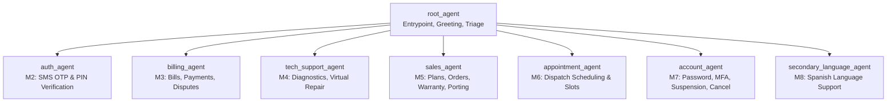

# Telco Voice Central — Conversational Voice Agent

**Application Display Name:** `sofiamejiamuro-[FDE-bootcamp]-telco-agent`  
**Platform:** Google Cloud Customer Engagement Suite (CES / CXAS)  
**Foundational Model:** `gemini-3.5-flash`  
**Interaction Modality:** `audio` (Voice First)  
**GCP Project:** `fde-bootcamp` (`84954549114`)  
**Deployment Region:** `us`  
**CES App Resource Path:** `projects/fde-bootcamp/locations/us/apps/a2630043-2939-46be-93b2-daef4c7fd3e8`  
**Web Console:** [Google CES Console](https://ces.cloud.google.com/projects/fde-bootcamp/locations/us/apps/a2630043-2939-46be-93b2-daef4c7fd3e8)  
**Git Repository:** `git@github.com:sofiamejiamuro-g/telco-agent.git`

---

## Table of Contents
1. [Executive Summary](#1-executive-summary)
2. [Business Perspective](#2-business-perspective)
   - [2.1 Business Objectives & ROI](#21-business-objectives--roi)
   - [2.2 Capability Modules (M1 to M8)](#22-capability-modules-m1-to-m8)
   - [2.3 Compliance, Security & Regulatory Mandates](#23-compliance-security--regulatory-mandates)
   - [2.4 Escalation & Human Handover Protocol](#24-escalation--human-handover-protocol)
3. [Technical Architecture](#3-technical-architecture)
   - [3.1 Multi-Agent Topology (Hub-and-Spoke)](#31-multi-agent-topology-hub-and-spoke)
   - [3.2 Session State & Context Variables](#32-session-state--context-variables)
   - [3.3 Backend Tools Inventory (23 Custom Integrations)](#33-backend-tools-inventory-23-custom-integrations)
   - [3.4 Audio & Voice Modality Tuning](#34-audio--voice-modality-tuning)
4. [Quality Assurance & Evaluation Suite](#4-quality-assurance--evaluation-suite)
   - [4.1 70 Simulation Scenarios (Public Evals)](#41-70-simulation-scenarios-public-evals)
   - [4.2 6-Stage Gate Verification](#42-6-stage-gate-verification)
   - [4.3 Hill Climbing & Pass Rate Optimization](#43-hill-climbing--pass-rate-optimization)
5. [Developer Operations & CLI Workflow](#5-developer-operations--cli-workflow)
   - [5.1 Environment Setup](#51-environment-setup)
   - [5.2 Linting & Zero Warnings Policy](#52-linting--zero-warnings-policy)
   - [5.3 Deploying to CES Platform](#53-deploying-to-ces-platform)
   - [5.4 Version Management & Rollback](#54-version-management--rollback)

---

## 1. Executive Summary

**Telco Voice Central** is an enterprise-grade, voice-first conversational AI agent built for telecom providers operating broadband, mobile wireless, cable TV, and VoIP services. Powered by **Gemini 3.5 Flash** on Google Customer Engagement Suite (CES), the agent orchestrates complex multi-turn phone calls across 8 specialized business domains.

The agent automates high-volume inquiries (identity verification, bill payments, diagnostic triage, appointment bookings, plan migrations) while maintaining strict legal compliance, security boundaries, and zero-latency backend execution via resilient mocked tools.

---

## 2. Business Perspective

### 2.1 Business Objectives & ROI
- **Increase First Contact Resolution (FCR)**: Resolves complex billing inquiries, payment promises, network triage, and scheduling changes without requiring agent transfers.
- **Reduce Average Handling Time (AHT)**: Authenticates callers progressively in <20 seconds and performs instant line diagnostics.
- **Deflection of Repetitive Tier-1 Load**: Automates routine tasks (MFA reset, suspension, autopay, outage notifications) 24/7/365.
- **Warm Agent Transfers**: When human intervention is legally or emotionally required, passes complete contextual transcripts and reason codes (`Customer_Care_Tier1`, `Technical_Support`, `Billing_Specialist`, `Retention_Team`).

### 2.2 Capability Modules (M1 to M8)

| Module | Business Function | Key Customer Capabilities |
|---|---|---|
| **M1: Lifecycle & Routing** | Inbound Call Management | Mandated recording disclosures, caller ID detection, restricted caller blocking, regional outage alerts, open-ended intent routing, language selection. |
| **M2: Identity & Authentication** | Security & Fraud Prevention | Progressive 3-tier authentication ladder (Tier 0 Caller ID, Tier 1 SMS OTP, Tier 2 PIN), 3-attempt lockout limits, alternative validation fallbacks. |
| **M3: Billing & Payments** | Financial Transactions | Balance checks, due dates, immediate payment processing, autopay setup, fee explanations, $50 billing dispute resolution policy. |
| **M4: Tech Support & Virtual Repair** | Service Assurance | Broadband/mobile/TV triage, live outage verification, virtual repair reboot workflows, trouble ticket status tracking, technician dispatch. |
| **M5: Sales & Equipment** | Growth & Retention | Plan catalog recommendations (Gigabit Fiber, 5G Unlimited), hardware upgrades, warranty claims, carrier port-in transfers. |
| **M6: Appointments & Field Service** | Operations | Technician dispatch slot discovery, 2-hour scheduling windows, appointment rescheduling and cancellations. |
| **M7: Account & Line Management** | Security Administration | Self-service password reset, MFA toggle, line suspension for lost/stolen devices, voluntary contract cancellations. |
| **M8: Multilingual & Accessibility** | Inclusivity | Native Spanish language handoff (`secondary_language_agent`), DTMF keypad input support, emergency 911 routing. |

### 2.3 Compliance, Security & Regulatory Mandates

The agent strictly enforces non-negotiable compliance rules specified in the development brief:

1. **Mandatory Recording Notice (`BR-TV-001`)**:
   - *Verbatim Disclosure:* `"This call may be recorded for quality and training purposes."`
   - Must be stated in the very first turn before any customer interaction.
2. **Contract Cancellation Fee Disclosure (`BR-TV-018`)**:
   - *Verbatim Disclosure:* `"Early contract termination may be subject to a fee of up to $200 depending on remaining contract duration. Do you still wish to proceed with cancellation?"`
   - Must be read verbatim before finalizing any service termination or port-out.
3. **Billing Dispute Credit Cap (`BR-TV-008`)**:
   - Automated dispute resolution is capped at $50.00. Disputes exceeding $50 automatically escalate to a live billing specialist.
4. **Data Privacy & PCI-DSS**:
   - Credit card CVV and full PAN are never read back or logged in plaintext.
   - Authentication OTPs and PINs are masked from external logging.
5. **Safety & Emergency Protocols (`BR-TV-014`)**:
   - Any mention of physical safety, suicide, emergency, or 911 triggers immediate live emergency assistance instructions and warm transfer.

### 2.4 Escalation & Human Handover Protocol

The agent never traps callers in infinite loops. It performs a warm transfer to a human specialist when:
- Caller explicitly requests a representative or presses `0` (`BR-TV-014`).
- Consecutive authentication failures reach 3 attempts (`BR-TV-005`).
- Negative sentiment or extreme frustration is detected (`BR-TV-019`).
- Legal or regulatory action is mentioned.

---

## 3. Technical Architecture

### 3.1 Multi-Agent Topology (Hub-and-Spoke)

The application follows the **Hub-and-Spoke** architecture recommended for Google Customer Engagement Suite. The `root_agent` serves as the sole entrypoint and dispatcher, routing to 7 specialist child agents.



#### Routing Rules:
- Sub-agents maintain clean scope; their `childAgents` arrays are empty (`[]`), ensuring compliance with CES single-parent hierarchy rules.
- Context is preserved during transfers via shared session variables.
- Specialist agents transfer back to `root_agent` or handover to live queues when customers switch topics.

### 3.2 Session State & Context Variables

The agent maintains session parameters declared in `app.json`:

| Variable | Type | Purpose |
|---|---|---|
| `auth_level` | `STRING` | Current security level (`Tier0_Identified`, `Tier1_OTP_Verified`, `Tier2_PIN_Verified`). |
| `cirn` | `STRING` | Customer Identifier Record Number (e.g. `CRN-8849`). |
| `clid` | `STRING` | Calling Line Identity / caller phone number. |
| `billing_account` | `STRING` | Customer billing account identifier (e.g. `BA-4921`). |
| `customer_type` | `STRING` | `Existing`, `New`, `Prepaid`, or `Business`. |
| `active_lob` | `STRING` | Current line of business (`internet`, `mobile`, `tv`, `voip`). |
| `outage_active` | `BOOLEAN` | Flags known regional infrastructure disruptions. |
| `auth_attempts` | `INTEGER` | Security counter tracking failed login attempts (max 3). |
| `language` | `STRING` | Session language (`en-US`, `es-ES`). |
| `handover_reason` | `STRING` | Reason code passed to human agent on escalation. |

### 3.3 Backend Tools Inventory (23 Custom Integrations)

All 23 tools are implemented in Python under `cxas_app/sofiamejiamuro-[FDE-bootcamp]-telco-agent/tools/`. Each tool returns a standardized JSON contract with explicit `agent_action` error guidance:

| Tool Name | Agent Binding | Description |
|---|---|---|
| `fetch_customer_profile` | `root_agent` | Resolves caller ID into CIRN, account type, and VIP status. |
| `evaluate_routing_rules` | `root_agent` | Classifies ambiguous customer intent for deterministic routing. |
| `check_regional_outage` | `root_agent`, `tech`, `sec_lang` | Verifies network alerts by ZIP code and line of business. |
| `send_authentication_otp` | `auth_agent` | Dispatches 6-digit one-time passcode via SMS. |
| `validate_authentication_otp`| `auth_agent` | Validates customer-entered OTP with attempt counting. |
| `validate_authentication_pin`| `auth_agent` | Validates 4-digit security PIN for Tier 2 access. |
| `fetch_recent_bills` | `billing_agent` | Retrieves billing history, past balances, and due dates. |
| `process_bill_payment` | `billing_agent` | Executes credit card / bank account bill payments. |
| `configure_autopay` | `billing_agent` | Enrolls or updates recurring payment schedules. |
| `create_dispute_ticket` | `billing_agent` | Logs charge disputes and issues credits up to $50. |
| `start_virtual_repair` | `tech_support_agent`, `sec_lang` | Triggers remote modem reboot and ONT diagnostics. |
| `fetch_ticket_status` | `tech_support_agent`, `appt` | Retrieves status and notes for open support tickets. |
| `fetch_availability_slots` | `appointment_agent` | Finds 2-hour technician dispatch appointment windows. |
| `commit_appointment_reschedule` | `appointment_agent` | Books, reschedules, or cancels field visits. |
| `fetch_plan_catalog` | `sales_agent` | Queries promotional internet, 5G, and TV bundles. |
| `place_product_order` | `sales_agent` | Processes equipment upgrades and new line orders. |
| `submit_warranty_claim` | `sales_agent` | Submits device replacement claims for defective hardware. |
| `initiate_number_transfer` | `sales_agent` | Generates port-out account credentials and PAC codes. |
| `send_password_reset_sms` | `account_agent` | Sends account portal password recovery links. |
| `manage_mfa_settings` | `account_agent` | Configures multi-factor authentication preferences. |
| `execute_suspend_restore` | `account_agent` | Temporarily pauses or restores service on lost/stolen SIMs. |
| `cancel_service_contract` | `account_agent` | Processes voluntary contract cancellations with fee disclosure. |
| `execute_live_agent_handover` | All agents | Performs warm queue transfer with context payload. |

### 3.4 Audio & Voice Modality Tuning
- **Modality:** `audio`
- **Model:** `gemini-3.5-flash`
- **Voice Output Guidelines:**
  - Instructions enforce concise spoken responses (2–3 sentences maximum).
  - Dollar amounts are formatted for natural speech synthesis (e.g. "forty-five dollars" rather than "$45").
  - Technical terms (ONT, SSID, Gateway) are accompanied by natural layperson explanations.

---

## 4. Quality Assurance & Evaluation Suite

### 4.1 70 Simulation Scenarios (Public Evals)
The repository contains 70 rigorous simulation evaluations defined in [`evals/simulations/public_sims.yaml`](file:///usr/local/google/home/sofiamejiamuro/src/gecx-fde-bootcamp/telco-agent/evals/simulations/public_sims.yaml).

These scenarios evaluate end-to-end multi-turn conversations using Gemini as the simulated customer across:
- `P0` High-priority core journeys (Cancellations, Outage handling, Auth retries, Payments).
- `P1` Complex multi-step operations (Virtual repairs, Technician rescheduling, Plan upgrades).
- Edge cases (Hostile callers, DTMF inputs, Language switching, Mid-call topic changes).

### 4.2 6-Stage Gate Verification
The platform deployment is verified by `gate-check.py`:
1. **Gate 1: Pull, Lint, & Push** — Validates local declarative structure against CES remote state.
2. **Gate 2: Agent Hierarchy** — Confirms 8 agents with `root_agent` as entrypoint.
3. **Gate 3: Tool Associations** — Verifies all 23 tools are bound to appropriate agents without schema errors.
4. **Gate 4: Callback Inventory** — Verifies deterministic callback code and test discovery.
5. **Gate 5: Single-Turn Smoke Test** — Connects to the live agent and validates standard greeting + recording disclosure.
6. **Gate 6: Multi-Turn Scenario Test** — Replays conversational trajectories.

### 4.3 Hill Climbing & Pass Rate Optimization
The repository supports iterative optimization via Hill Climbing:
- **Baseline**: Run full public evals suite to establish starting pass rate.
- **Cluster**: Group failures into `TOOL_MISSING`, `ROUTING_ERROR`, `EXPECTATION_FAIL`.
- **Targeted Fix**: Refine agent instructions or mock tool responses.
- **Auto-Revert**: Discards any changes that introduce score regressions.
- **Snapshot**: Freezes immutable version tags in CES once target pass rates are achieved.

---

## 5. Developer Operations & CLI Workflow

### 5.1 Environment Setup

Activate the shared Python virtual environment:
```bash
# Activate environment
source .venv/bin/activate

# Verify GCP Application Default Credentials
gcloud auth application-default print-access-token
gcloud auth application-default set-quota-project fde-bootcamp
```

### 5.2 Linting & Zero Warnings Policy

Run the structural linter before pushing any changes. The project strictly enforces a **Zero Warnings Policy**:
```bash
cxas lint --app-dir "cxas_app/sofiamejiamuro-[FDE-bootcamp]-telco-agent"
```

### 5.3 Deploying to CES Platform

Push local agent configurations, prompts, and tools to the active Google CES app:
```bash
cxas push \
  --app-dir "cxas_app/sofiamejiamuro-[FDE-bootcamp]-telco-agent" \
  --to "projects/fde-bootcamp/locations/us/apps/a2630043-2939-46be-93b2-daef4c7fd3e8" \
  --project-id "fde-bootcamp" \
  --location "us"
```

Run post-deployment smoke verification:
```bash
python .agents/skills/cxas-agent-foundry/scripts/gate-check.py
```

### 5.4 Version Management & Rollback

Snapshot immutable versions directly on the platform:
```bash
# Create snapshot
cxas versions create \
  --app-name "projects/fde-bootcamp/locations/us/apps/a2630043-2939-46be-93b2-daef4c7fd3e8" \
  --display-name "v1.0-production-baseline" \
  --description "Telco Voice Central baseline with 8 agents and 23 tools"

# List versions
cxas versions list \
  --app-name "projects/fde-bootcamp/locations/us/apps/a2630043-2939-46be-93b2-daef4c7fd3e8"
```

---

## 6. Project Structure

```
telco-agent/
├── README.md                      # Complete business & technical documentation (this file)
├── AGENTS.md                      # Workspace & SDK overview
├── gecx-config.json               # Active GCP project, CES app ID, and modality config
├── tdd.md                         # Technical Design Document (PRD-to-Agent mapping)
├── todo.md                        # Build gate tracking checklist
├── scaffold_telco_agent.py        # Declarative agent scaffolding script
├── cxas_app/
│   └── sofiamejiamuro-[FDE-bootcamp]-telco-agent/
│       ├── app.json               # Global app config, rootAgent, session variables
│       ├── agents/                # 8 Sub-agents (root, auth, billing, tech, sales, etc.)
│       │   └── <agent_name>/
│       │       ├── <agent_name>.json
│       │       └── instruction.txt
│       └── tools/                 # 23 Custom Python tools
│           └── <tool_name>/
│               ├── <tool_name>.json
│               └── python_function/python_code.py
├── evals/
│   ├── simulations/
│   │   └── public_sims.yaml       # 70 Public simulation evaluation scenarios
│   ├── goldens/
│   │   └── compliance_goldens.yaml# Deterministic turn-by-turn compliance goldens
│   └── tool_tests/
│       └── tool_tests.yaml        # Isolated tool contract verification tests
└── .artifacts/
    ├── telco_voice_central_brief.md                 # 25-page development brief & requirements
    └── greenfield_agent_building_public_evals.yaml  # Benchmark eval definitions
```
