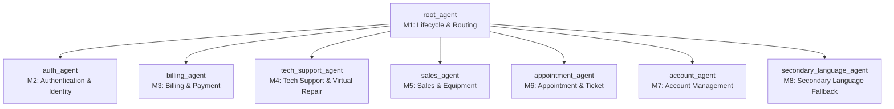

# Technical Design Document (TDD) — Telco Voice Central

**Mode:** Draft from requirements  
**Sources:**
- `telco-agent/.artifacts/telco_voice_central_brief.md` (Functional spec & capability inventory)
- `telco-agent/.venv/greenfield_agent_building_public_evals.yaml` (70 simulation eval scenarios)

---

## 1. Agent Design

### 1.1 Architecture
- **Modality:** `audio` (Voice Agent)
- **Model:** `gemini-3.5-flash`
- **Pattern:** Hub-and-Spoke Multi-Agent Architecture

#### Agent Hierarchy & Responsibilities
1. **`root_agent` (M1: Session Lifecycle & Routing)**:
   - First touchpoint for all incoming calls.
   - Emits verbatim recording notice (`BR-TV-001`) and standard greeting.
   - Detects caller ID, checks restricted callers (`BR-TV-002`), checks regional service alerts (`BR-TV-003`).
   - Detects and locks caller language (`BR-TV-004`).
   - Performs open-ended intent capture and routes to specialist agents via `child_agents`.
   - Handles immediate human agent requests (`user_requested_agent`), DTMF `0` press, and after-hours escalation rules (`BR-TV-014`).
   - Acts as the central pivot for topic switches (`BR-TV-019`).

2. **`auth_agent` (M2: Authentication & Identity)**:
   - Manages the three auth states: `Guest` -> `Identified` -> `Authenticated`.
   - Handles OTP flow (6-digit SMS code) and PIN fallback flow (4-digit DTMF PIN).
   - Enforces 3-strike failure escalation (`auth_failure_handoff`).
   - Never echoes PIN or OTP back to the caller (`BR-TV-009`).
   - Explicit fraud claims immediately bypass authentication and escalate (`fraud_escalation`).

3. **`billing_agent` (M3: Billing & Payment)**:
   - Handles recent bill queries, bill dispute cases, payment processing, autopay configuration, refunds, and payment arrangements.
   - Requires `auth_status == Pass` before referencing or mutating account bill details.
   - Prepends verbatim `payment_method_preamble` before taking payment cards via DTMF.
   - Issues auto-eligible adjustments using verbatim `refund_confirmation_pattern`; escalates refunds exceeding policy threshold (`refund_threshold_exceeded`).

4. **`tech_support_agent` (M4: Technical Support & Virtual Repair)**:
   - Checks active regional outages (`outage_active`) before starting diagnostics.
   - Disambiguates TV subtypes (`streaming` vs `satellite`).
   - Runs virtual-repair sessions for internet, TV, and phone troubleshooting.
   - Delivers step-by-step instructions via SMS for sequences longer than 2 steps.
   - Offers technician visit handoff (routing back to M1 -> M6) if unresolved.

5. **`sales_agent` (M5: Sales & Equipment)**:
   - Checks service coverage at address, browses plan catalog, places new orders, handles warranty claims, and initiates number port-ins.
   - Deflects business accounts with verbatim `business_handoff` (`BR-TV-012`).
   - Restricts presented plan options to 2–3 comparable choices.

6. **`appointment_agent` (M6: Appointment & Ticket Management)**:
   - Looks up active appointments and existing support tickets.
   - Offers 2–3 availability slots for booking or rescheduling.
   - Handles same-day cancellations (with double confirmation) and prevents en-route technician cancellations (offers note-taking instead).
   - Offers SMS callback when no appointment slots match requested windows.

7. **`account_agent` (M7: Account Management)**:
   - Dispatches password-reset SMS links (30-minute validity).
   - Manages MFA enable/disable (requires step-up authentication).
   - Handles fraud reports with verbatim `empathy_protocol` and immediate escalation (`fraud_escalation`).
   - Manages service suspension and restoration (cross-module routing back to M1 -> M3 if balance owed).
   - Handles service cancellation and port-out requests with mandatory contract cancellation fee disclosure.

8. **`secondary_language_agent` (M8: Secondary Language Fallback)**:
   - Specialized technical support in the secondary language (Spanish) when primary cannot cover without language degradation.
   - Terminal fallback to live representative (`secondary_language_live_agent`) with localized verbatim copy.

---

### 1.2 Tools

All tools are implemented as Python functions with `mock_mode` support (`session_params.get("mock_mode") == "True"` or eval mock params) so that evals and CI tests execute deterministically with sub-second latency.

| Tool Name | Type | Purpose | Module |
|---|---|---|---|
| `fetch_customer_profile` | Python function | Lookup customer profile by `clid` / phone number (returns `cirn`, `customer_type`, `business_flag`, `is_prepaid`). | M1, M2 |
| `send_authentication_otp` | Python function | Dispatch 6-digit verification code to customer phone number. | M2 |
| `validate_authentication_otp` | Python function | Validate entered OTP code; decrements retry attempts; returns `Pass` or `Fail`. | M2 |
| `validate_authentication_pin` | Python function | Validate 4-digit DTMF PIN; returns `Pass` or `Fail`. | M2 |
| `evaluate_routing_rules` | Python function | Classify caller intent and determine destination module and auth requirements. | M1 |
| `fetch_recent_bills` | Python function | Retrieve past billing statements, recent charges, line items, and current balance. | M3 |
| `create_dispute_ticket` | Python function | File a formal billing dispute ticket for charges above threshold. | M3 |
| `process_bill_payment` | Python function | Process balance payment using stored or tokenized payment method. | M3 |
| `configure_autopay` | Python function | Enable/update recurring autopay with bank account or card. | M3 |
| `check_regional_outage` | Python function | Check if customer's region and line-of-business has an active outage. | M4 |
| `start_virtual_repair` | Python function | Initialize a diagnostic virtual repair session and return troubleshooting steps. | M4 |
| `fetch_availability_slots` | Python function | Retrieve available technician appointment arrival windows. | M6 |
| `commit_appointment_reschedule` | Python function | Book, reschedule, or cancel a technician appointment; send SMS confirmation. | M6 |
| `fetch_ticket_status` | Python function | Look up open support ticket details and technician arrival ETA. | M4, M6 |
| `fetch_plan_catalog` | Python function | Retrieve available subscription plans, upgrades, and add-ons by LOB. | M5 |
| `place_product_order` | Python function | Place order for hardware, plan upgrade, or new service line; send SMS receipt. | M5 |
| `submit_warranty_claim` | Python function | Submit device warranty repair/replacement claim based on device warranty status. | M5 |
| `initiate_number_transfer` | Python function | Process incoming mobile number port-in request. | M5 |
| `send_password_reset_sms` | Python function | Dispatch secure password reset link (30-minute validity) via SMS. | M7 |
| `manage_mfa_settings` | Python function | Enable or disable multi-factor authentication after step-up auth. | M7 |
| `execute_suspend_restore` | Python function | Execute service line suspension (lost/stolen/travel) or restoration. | M7 |
| `cancel_service_contract` | Python function | Finalize contract cancellation and port-out request after reading fee disclosure. | M7 |
| `execute_live_agent_handover` | Python function | Transfer caller to live queue with full session parameters and escalation reason. | Handoff |
| `end_session` | System tool | Built-in system tool to terminate call after conclusion or malicious input. | System |

---

### 1.3 Routing Logic & Priority Hierarchy

#### Priority Resolution (Section 20)
When multiple conditions trigger simultaneously, resolve in strict order:
1. **Safety signals** (self-harm, threat, malicious input) -> empathy line + immediate escalation or session end (`malicious_input`).
2. **Fraud claim** -> reason `fraud_escalation` (no auth attempt, no self-serve).
3. **System-error escalation** -> hard tool errors (`SYSTEM_DOWN`, `INTERNAL_ERROR`) -> immediate handoff (`system_unavailable`).
4. **Explicit "talk to a person"** / DTMF `0` -> verbatim `live_agent_handoff`, reason `user_requested_agent`.
5. **Business-account handoff** -> `business_flag == true` -> verbatim `business_handoff`.
6. **Retry-strike escalation** -> 3x no-input (`no_input_escalation`) or 3x no-match (`disambig_max_attempts`).
7. **Compliance-locked verbatim turns** -> recording notice, PCI preamble, cancellation-fee disclosure, refund confirmation.
8. **Authenticated account actions** -> perform customer task.
9. **Disambiguation** -> single targeted clarifying question (max 3 attempts).
10. **Small talk / recap / closing** -> lowest priority.

#### Topic Switching (`BR-TV-019`)
If a customer pivots mid-call (e.g., in billing dispute, says *"This is too much hassle, I just want to cancel"*), the agent immediately yields control, re-classifies, and transfers to the appropriate specialist without forcing completion of the previous flow.

---

### 1.4 Session Variables

All variables are declared in `app.json`.

| Variable Name | Type | Source | Never Override in Evals? | Notes |
|---|---|---|---|---|
| `clid` | STRING | session param | No | 10-digit caller ID. |
| `tfn` | STRING | session param | No | Toll-free dialed number. |
| `cirn` | STRING | captured / tool | No | Customer reference number (PII: last-4 only). |
| `billing_account` | STRING | captured / tool | No | Billing account number (PII: last-4 only). |
| `customer_type` | STRING | tool | No | `New` \| `Existing`. |
| `user_id` | STRING | tool | No | Internal CRM user ID. |
| `auth_status` | STRING | tool | **YES** | `Pass` \| `Fail`. Must come from tool verification. |
| `identification_status`| STRING | tool | **YES** | `Pass` \| `Fail`. |
| `business_flag` | STRING | tool / session param | No | `'True'` \| `'False'`. |
| `route` | STRING | classifier / tool | No | Active route destination. |
| `lob` | STRING | captured | No | `mobility` \| `internet` \| `tv` \| `homephone` \| `smarthome`. |
| `tv_sub_type` | STRING | captured | No | `streaming` \| `satellite` \| `streaming_only`. |
| `region` | STRING | tool | No | Region identifier for outage checking. |
| `language` | STRING | detected / channel | No | `primary` (English) \| `secondary` (Spanish). |
| `dtmf_digits` | STRING | preprocessing | No | Normalized DTMF keypresses. |
| `local_noinput_counter`| STRING | preprocessing | **YES** | Per-module no-input count. |
| `global_err_count` | STRING | preprocessing | **YES** | Cross-module error count. |
| `no_match_confirmation_count` | STRING | preprocessing | **YES** | No-match budget. |
| `mock_mode` | STRING | session param | No | Synthetic test mode flag. |
| `mock_queue_closed`| STRING | session param | No | Forces after-hours closed queue simulation. |
| `ticket_state` | STRING | tool | No | `open` \| `in-progress` \| `closed`. |
| `sms_content` | STRING | captured / tool | No | Content of dispatched SMS. |

---

### 1.5 Callbacks

1. **`before_turn_preprocessing`** (attached to `root_agent` as `before_model_callback` and `before_agent_callback`):
   - Normalizes DTMF digits into `dtmf_digits`.
   - Tracks no-input events (increments `local_noinput_counter`).
   - Classifies tool error responses into System, Business, or Validation envelopes.
   - Evaluates active regional alerts and prepends advisory banners when applicable.
   - Inspects after-hours status and queues.

---

## 2. Eval Design

### 2.1 Coverage Map

The test suite covers the 20 Behavioral Requirements (`BR-TV-001` through `BR-TV-020`) and all 70 Public Simulation Scenarios:

| Requirement / Scope | Eval Type | Rationale | Priority | Severity | Tags |
|---|---|---|---|---|---|
| `BR-TV-001` Recording Notice | Golden | Verbatim string assertion on opening turn | P0 | NO-GO | `compliance`, `greeting` |
| `BR-TV-002` Restricted Caller Check | Golden / Sim | Blocked callers hear deflection and disconnect | P0 | NO-GO | `security`, `lifecycle` |
| `BR-TV-003` Regional Service Alert | Golden | Advisory banner prepended to greeting | P1 | HIGH | `advisory`, `outage` |
| `BR-TV-004` Language Locking | Sim | Turn-1 detection sticky across turns | P0 | NO-GO | `language`, `multilingual` |
| `BR-TV-006` Retry Strikes (3-strike) | Sim | 3 no-inputs / no-matches trigger escalation | P0 | NO-GO | `retry`, `escalation` |
| `BR-TV-008` Auth Ladder (OTP & PIN) | Sim | Guest -> Identified -> Authenticated flows & retries | P0 | NO-GO | `auth`, `security` |
| `BR-TV-009` PII Redaction | Golden | Asserts last-4 readback only; never echo PIN/OTP | P0 | NO-GO | `compliance`, `pii` |
| `BR-TV-011` Verbatim Copy | Golden | Exact substring matches across 12 compliance strings | P0 | NO-GO | `compliance`, `verbatim` |
| `BR-TV-012` Business Account Handoff | Sim | `business_flag == 'True'` triggers immediate transfer | P0 | NO-GO | `sales`, `business` |
| `BR-TV-013` Fraud Escalation | Sim | Empathy protocol + immediate transfer without auth | P0 | NO-GO | `fraud`, `security` |
| `BR-TV-014` After-Hours Awareness | Sim | Queue closure routes sales/cancellations to next business day | P0 | HIGH | `after-hours`, `routing` |
| `BR-TV-019` Topic Switch Mid-Call | Sim | Mid-call pivot between billing, support, and cancel | P0 | HIGH | `dialogue`, `pivot` |
| `sim__cancel_service_*` (6 scenarios) | Sim | Moving, port-out, auth retry, business, pivot, after-hours | P0 | NO-GO | `account`, `cancellation` |
| `sim__immediate_request` & Live Agent (6 scenarios) | Sim | DTMF 0, billing query, Spanish handoff, troubleshooting handoff | P0 | NO-GO | `handoff`, `agent` |
| `sim__tech_status_*` & `ticket_status_*` (5 scenarios) | Sim | Arrival window, multi-appt disambiguation, en-route note | P0 | HIGH | `appointment`, `ticket` |
| `sim__password_reset_*` (5 scenarios) | Sim | SMS link, mobile fallback, OTP fail, business, pivot | P0 | HIGH | `account`, `security` |
| `sim__enable_mfa_*` & `disable_mfa_*` (5 scenarios) | Sim | Step-up auth, secondary language, vague requests | P0 | HIGH | `account`, `mfa` |
| `sim__report_fraud_*` (5 scenarios) | Sim | Unauthorized charges, ID theft, mid-call discovery, stolen phone | P0 | NO-GO | `fraud`, `safety` |
| `sim__restore_service_*` (5 scenarios) | Sim | Non-payment clearance, lost/stolen found, refusal, business | P0 | HIGH | `account`, `billing` |
| `sim__sim_working_*` & `phone_locked_*` (5 scenarios) | Sim | PUK codes, replacement SIM, unlock, input retry | P0 | HIGH | `tech_support`, `sim` |
| `sim__upgrade_plan_*` & `add_tv_*` (5 scenarios) | Sim | Data upgrade, TV existing, streaming add-on, business block | P0 | MEDIUM | `sales`, `plans` |
| `sim__warranty_claim_*` (4 scenarios) | Sim | Battery defect, out-of-warranty, physical damage, fraud pivot | P0 | HIGH | `sales`, `warranty` |
| `sim__transfer_number_*` (3 scenarios) | Sim | Happy path, missing PIN, business block | P0 | HIGH | `sales`, `port-in` |
| `sim__appointment_*` (5 scenarios) | Sim | Book, reschedule, same-day cancel, en-route cancel, SMS callback | P0 | HIGH | `appointment` |
| `sim__billing_*` & `dispute_*` (4 scenarios) | Sim | Dispute charge, pay bill, autopay setup, refund request | P0 | HIGH | `billing`, `payments` |
| Tool Contract Tests | Tool Test | Validate 100% of tools with real and mock responses | P0 | NO-GO | `tools`, `contracts` |
| Callback Preprocessing Tests | Callback Test | Verify DTMF, no-input, error classification logic | P0 | NO-GO | `callbacks` |

---

## 3. Tracking

### 3.1 Pass Rate History
| Iteration | Date | Total Evals | Passed | Failed | Pass Rate | Notes |
|---|---|---|---|---|---|---|
| 0 | 2026-09-15 | 70 | 0 | 70 | 0% | Initial baseline pre-build |

### 3.2 Known Issues
- None currently identified.

### 3.3 Changelog
- **2026-09-15**: Initial requirements-derived TDD draft from `telco_voice_central_brief.md` and `greenfield_agent_building_public_evals.yaml`.

---
*Review and approve before scaffolding the agent.*
